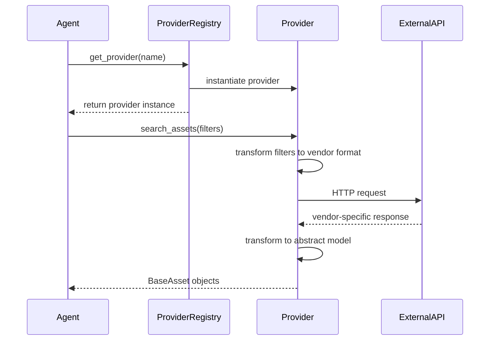

# Provider Abstraction Layer Architecture

## Executive Summary

This document defines the architecture for a provider abstraction layer that will decouple the SafetyCulture agent from vendor-specific APIs, enabling support for multiple inspection platforms (Procore, Autodesk BIM 360, PlanGrid, etc.) while maintaining backward compatibility.

**Key Benefits:**
- Eliminate vendor lock-in
- Enable multi-provider scenarios
- Improve testability with mock providers
- Support runtime provider switching
- Maintain backward compatibility

---

## 1. Architecture Overview

### 1.1 System Architecture Diagram

```
┌─────────────────────────────────────────────────────────────────┐
│                      Agent Layer                                │
│  (agent.py, sub-agents, tools)                                  │
│  - No changes required to agent logic                           │
└────────────────────┬────────────────────────────────────────────┘
                     │
                     │ Uses abstracted interface
                     ▼
┌─────────────────────────────────────────────────────────────────┐
│              Provider Abstraction Layer                         │
│                                                                  │
│  ┌──────────────────────────────────────────────────────────┐  │
│  │         BaseInspectionAPIProvider (ABC)                  │  │
│  │  - search_assets()      - create_inspection()           │  │
│  │  - get_asset()          - update_inspection()           │  │
│  │  - search_templates()   - get_inspection()              │  │
│  │  - get_template()       - delete_inspection()           │  │
│  └──────────────────────────────────────────────────────────┘  │
│                             ▲                                    │
│                             │                                    │
│         ┌───────────────────┼───────────────────┐              │
│         │                   │                   │              │
│  ┌──────┴──────┐   ┌────────┴────────┐   ┌─────┴──────┐      │
│  │SafetyCulture│   │    Procore      │   │   BIM360   │      │
│  │  Provider   │   │   Provider      │   │  Provider  │      │
│  └──────┬──────┘   └────────┬────────┘   └─────┬──────┘      │
│         │                   │                   │              │
└─────────┼───────────────────┼───────────────────┼──────────────┘
          │                   │                   │
          │                   │                   │
          ▼                   ▼                   ▼
┌─────────────────┐  ┌─────────────────┐  ┌─────────────────┐
│ SafetyCulture   │  │   Procore API   │  │  BIM360 API     │
│      API        │  │                 │  │                 │
└─────────────────┘  └─────────────────┘  └─────────────────┘
```

### 1.2 Component Interaction Flow



### 1.3 Class Hierarchy

```
BaseInspectionAPIProvider (ABC)
├── BaseSite
├── BaseAsset
├── BaseTemplate
├── BaseInspection
└── BaseInspectionItem

SafetyCultureProvider (Concrete)
├── SafetyCultureSite
├── SafetyCultureAsset
├── SafetyCultureTemplate
├── SafetyCultureInspection
└── SafetyCultureInspectionItem

ProcoreProvider (Future)
MockProvider (Testing)
```

---

## 2. Abstract Base Classes Specification

### 2.1 BaseInspectionAPIProvider

```python
from __future__ import annotations

from abc import ABC, abstractmethod
from typing import Any, Dict, List, Optional

class BaseInspectionAPIProvider(ABC):
  """Abstract base class for inspection API providers.
  
  This defines the contract that all provider implementations must follow.
  Each provider adapter must implement all abstract methods to integrate
  with the agent system.
  """
  
  @abstractmethod
  async def initialize(self) -> None:
    """Initialize provider connection and resources.
    
    Raises:
        ProviderConnectionError: If initialization fails
    """
    pass
  
  @abstractmethod
  async def authenticate(self) -> bool:
    """Authenticate with the provider API.
    
    Returns:
        True if authentication successful, False otherwise
        
    Raises:
        ProviderAuthError: If authentication fails
    """
    pass
  
  @abstractmethod
  async def search_assets(
      self,
      asset_types: Optional[List[str]] = None,
      site_ids: Optional[List[str]] = None,
      limit: int = 100,
      offset: int = 0,
      **kwargs
  ) -> List[BaseAsset]:
    """Search for assets with filters.
    
    Args:
        asset_types: List of asset type identifiers
        site_ids: List of site/location identifiers
        limit: Maximum results to return
        offset: Pagination offset
        **kwargs: Provider-specific additional filters
        
    Returns:
        List of BaseAsset objects
        
    Raises:
        ProviderAPIError: If search fails
    """
    pass
  
  @abstractmethod
  async def get_asset(self, asset_id: str) -> BaseAsset:
    """Get detailed asset information.
    
    Args:
        asset_id: Unique asset identifier
        
    Returns:
        BaseAsset object with full details
        
    Raises:
        ProviderNotFoundError: If asset not found
        ProviderAPIError: If retrieval fails
    """
    pass
  
  @abstractmethod
  async def search_templates(
      self,
      name_filter: Optional[str] = None,
      include_archived: bool = False,
      **kwargs
  ) -> List[BaseTemplate]:
    """Search for inspection templates.
    
    Args:
        name_filter: Optional name filter
        include_archived: Include archived templates
        **kwargs: Provider-specific filters
        
    Returns:
        List of BaseTemplate objects
        
    Raises:
        ProviderAPIError: If search fails
    """
    pass
  
  @abstractmethod
  async def get_template(self, template_id: str) -> BaseTemplate:
    """Get detailed template information.
    
    Args:
        template_id: Unique template identifier
        
    Returns:
        BaseTemplate object with structure
        
    Raises:
        ProviderNotFoundError: If template not found
        ProviderAPIError: If retrieval fails
    """
    pass
  
  @abstractmethod
  async def create_inspection(
      self,
      template_id: str,
      title: Optional[str] = None,
      asset_id: Optional[str] = None,
      site_id: Optional[str] = None,
      metadata: Optional[Dict[str, Any]] = None
  ) -> BaseInspection:
    """Create new inspection from template.
    
    Args:
        template_id: Template to use
        title: Optional inspection title
        asset_id: Optional asset being inspected
        site_id: Optional site/location
        metadata: Provider-specific metadata
        
    Returns:
        Created BaseInspection object
        
    Raises:
        ProviderAPIError: If creation fails
    """
    pass
  
  @abstractmethod
  async def update_inspection(
      self,
      inspection_id: str,
      field_updates: List[Dict[str, Any]]
  ) -> BaseInspection:
    """Update inspection field values.
    
    Args:
        inspection_id: Inspection to update
        field_updates: List of field updates
        
    Returns:
        Updated BaseInspection object
        
    Raises:
        ProviderAPIError: If update fails
    """
    pass
  
  @abstractmethod
  async def get_inspection(self, inspection_id: str) -> BaseInspection:
    """Get inspection details.
    
    Args:
        inspection_id: Unique inspection identifier
        
    Returns:
        BaseInspection object
        
    Raises:
        ProviderNotFoundError: If inspection not found
        ProviderAPIError: If retrieval fails
    """
    pass
  
  @abstractmethod
  async def delete_inspection(self, inspection_id: str) -> bool:
    """Delete an inspection.
    
    Args:
        inspection_id: Inspection to delete
        
    Returns:
        True if successful, False otherwise
        
    Raises:
        ProviderAPIError: If deletion fails
    """
    pass
  
  @abstractmethod
  async def get_rate_limit_status(self) -> Dict[str, Any]:
    """Get current rate limit status.
    
    Returns:
        Dictionary with rate limit information:
            - limit: Total requests allowed
            - remaining: Requests remaining
            - reset_time: When limit resets
    """
    pass
  
  @abstractmethod
  def get_provider_info(self) -> Dict[str, Any]:
    """Get provider metadata.
    
    Returns:
        Dictionary with:
            - name: Provider name
            - version: Provider version
            - capabilities: List of supported features
    """
    pass
```

### 2.2 Abstract Data Models

```python
from dataclasses import dataclass
from datetime import datetime
from typing import Any, Dict, List, Optional

@dataclass
class BaseSite:
  """Abstract representation of a site/location."""
  
  id: str
  name: str
  parent_id: Optional[str] = None
  metadata: Dict[str, Any] = None
  
  def to_dict(self) -> Dict[str, Any]:
    """Convert to dictionary representation."""
    return {
      'id': self.id,
      'name': self.name,
      'parent_id': self.parent_id,
      'metadata': self.metadata or {}
    }


@dataclass
class BaseAsset:
  """Abstract representation of an asset."""
  
  id: str
  name: str
  asset_type: str
  site_id: Optional[str] = None
  site_name: Optional[str] = None
  status: str = "active"
  custom_fields: Dict[str, Any] = None
  created_at: Optional[datetime] = None
  modified_at: Optional[datetime] = None
  metadata: Dict[str, Any] = None
  
  def to_dict(self) -> Dict[str, Any]:
    """Convert to dictionary representation."""
    return {
      'id': self.id,
      'name': self.name,
      'asset_type': self.asset_type,
      'site_id': self.site_id,
      'site_name': self.site_name,
      'status': self.status,
      'custom_fields': self.custom_fields or {},
      'created_at': self.created_at.isoformat() if self.created_at else None,
      'modified_at': self.modified_at.isoformat() if self.modified_at else None,
      'metadata': self.metadata or {}
    }


@dataclass
class BaseTemplate:
  """Abstract representation of an inspection template."""
  
  id: str
  name: str
  items: List[BaseInspectionItem]
  version: Optional[str] = None
  archived: bool = False
  created_at: Optional[datetime] = None
  modified_at: Optional[datetime] = None
  metadata: Dict[str, Any] = None
  
  def to_dict(self) -> Dict[str, Any]:
    """Convert to dictionary representation."""
    return {
      'id': self.id,
      'name': self.name,
      'version': self.version,
      'archived': self.archived,
      'items': [item.to_dict() for item in self.items],
      'created_at': self.created_at.isoformat() if self.created_at else None,
      'modified_at': self.modified_at.isoformat() if self.modified_at else None,
      'metadata': self.metadata or {}
    }


@dataclass
class BaseInspectionItem:
  """Abstract representation of a template/inspection item."""
  
  id: str
  label: str
  item_type: str  # text, number, checkbox, date, media, etc.
  required: bool = False
  response: Optional[Any] = None
  metadata: Dict[str, Any] = None
  
  def to_dict(self) -> Dict[str, Any]:
    """Convert to dictionary representation."""
    return {
      'id': self.id,
      'label': self.label,
      'item_type': self.item_type,
      'required': self.required,
      'response': self.response,
      'metadata': self.metadata or {}
    }


@dataclass
class BaseInspection:
  """Abstract representation of an inspection."""
  
  id: str
  template_id: str
  template_name: str
  title: Optional[str] = None
  asset_id: Optional[str] = None
  site_id: Optional[str] = None
  inspector: Optional[str] = None
  status: str = "in_progress"  # in_progress, completed, archived
  items: List[BaseInspectionItem] = None
  created_at: Optional[datetime] = None
  modified_at: Optional[datetime] = None
  completed_at: Optional[datetime] = None
  metadata: Dict[str, Any] = None
  
  def to_dict(self) -> Dict[str, Any]:
    """Convert to dictionary representation."""
    return {
      'id': self.id,
      'template_id': self.template_id,
      'template_name': self.template_name,
      'title': self.title,
      'asset_id': self.asset_id,
      'site_id': self.site_id,
      'inspector': self.inspector,
      'status': self.status,
      'items': [item.to_dict() for item in (self.items or [])],
      'created_at': self.created_at.isoformat() if self.created_at else None,
      'modified_at': self.modified_at.isoformat() if self.modified_at else None,
      'completed_at': self.completed_at.isoformat() if self.completed_at else None,
      'metadata': self.metadata or {}
    }
```

---

## 3. Provider Registry Pattern

### 3.1 Registry Implementation

```python
from __future__ import annotations

import logging
from typing import Dict, Optional, Type

logger = logging.getLogger(__name__)


class ProviderRegistry:
  """Registry for managing inspection API providers.
  
  Implements factory pattern for provider instantiation and
  supports runtime provider discovery and switching.
  """
  
  _providers: Dict[str, Type[BaseInspectionAPIProvider]] = {}
  _instances: Dict[str, BaseInspectionAPIProvider] = {}
  
  @classmethod
  def register(
      cls,
      name: str,
      provider_class: Type[BaseInspectionAPIProvider]
  ) -> None:
    """Register a provider implementation.
    
    Args:
        name: Unique provider name
        provider_class: Provider class to register
        
    Raises:
        ValueError: If provider already registered
    """
    if name in cls._providers:
      raise ValueError(f"Provider '{name}' already registered")
    
    cls._providers[name] = provider_class
    logger.info(f"Registered provider: {name}")
  
  @classmethod
  def unregister(cls, name: str) -> None:
    """Unregister a provider.
    
    Args:
        name: Provider name to unregister
    """
    if name in cls._providers:
      del cls._providers[name]
      if name in cls._instances:
        del cls._instances[name]
      logger.info(f"Unregistered provider: {name}")
  
  @classmethod
  async def get_provider(
      cls,
      name: str,
      config: Optional[Dict] = None,
      use_cache: bool = True
  ) -> BaseInspectionAPIProvider:
    """Get provider instance.
    
    Args:
        name: Provider name
        config: Optional provider configuration
        use_cache: Use cached instance if available
        
    Returns:
        Provider instance
        
    Raises:
        ValueError: If provider not found
        ProviderInitError: If initialization fails
    """
    if name not in cls._providers:
      raise ValueError(
        f"Provider '{name}' not found. "
        f"Available: {list(cls._providers.keys())}"
      )
    
    # Return cached instance if requested
    if use_cache and name in cls._instances:
      return cls._instances[name]
    
    # Create new instance
    provider_class = cls._providers[name]
    provider = provider_class(config or {})
    
    # Initialize provider
    await provider.initialize()
    
    # Cache if requested
    if use_cache:
      cls._instances[name] = provider
    
    return provider
  
  @classmethod
  def list_providers(cls) -> List[str]:
    """List all registered providers.
    
    Returns:
        List of provider names
    """
    return list(cls._providers.keys())
  
  @classmethod
  def clear_cache(cls) -> None:
    """Clear all cached provider instances."""
    cls._instances.clear()
    logger.info("Cleared provider cache")
```

### 3.2 Configuration Schema

```yaml
# config/providers.yaml

providers:
  safetyculture:
    type: "safetyculture"
    enabled: true
    config:
      base_url: "https://api.safetyculture.io"
      api_token_env: "SAFETYCULTURE_API_TOKEN"
      rate_limit:
        requests_per_second: 10
        burst_multiplier: 2
      timeout: 30
      max_retries: 3
      retry_delay: 1.0
      circuit_breaker:
        failure_threshold: 5
        success_threshold: 2
        timeout: 60
    
  procore:
    type: "procore"
    enabled: false
    config:
      base_url: "https://api.procore.com"
      client_id_env: "PROCORE_CLIENT_ID"
      client_secret_env: "PROCORE_CLIENT_SECRET"
      rate_limit:
        requests_per_second: 20
        burst_multiplier: 3
      timeout: 30
      oauth:
        token_url: "https://login.procore.com/oauth/token"
        scopes: ["inspections.read", "inspections.write"]
  
  mock:
    type: "mock"
    enabled: true
    config:
      # Mock provider for testing - no external dependencies
      simulate_delays: false
      failure_rate: 0.0

# Default provider to use
default_provider: "safetyculture"

# Multi-provider mode (experimental)
multi_provider:
  enabled: false
  strategy: "failover"  # failover, parallel, or round_robin
  providers: ["safetyculture", "procore"]
```

---

## 4. SafetyCulture Provider Adapter

### 4.1 Adapter Implementation Structure

```python
from __future__ import annotations

from datetime import datetime
from typing import Any, Dict, List, Optional

from ..providers.base import (
    BaseAsset,
    BaseInspection,
    BaseInspectionAPIProvider,
    BaseInspectionItem,
    BaseTemplate,
)
from ..exceptions import ProviderAPIError, ProviderAuthError


class SafetyCultureProvider(BaseInspectionAPIProvider):
  """SafetyCulture API provider implementation.
  
  Adapts SafetyCulture-specific API to abstract provider interface.
  """
  
  def __init__(self, config: Dict[str, Any]):
    """Initialize SafetyCulture provider.
    
    Args:
        config: Provider configuration dictionary
    """
    self.config = config
    self._client = None  # SafetyCultureAPIClient instance
    self._authenticated = False
  
  async def initialize(self) -> None:
    """Initialize SafetyCulture API client."""
    from ..tools.safetyculture_api_client import SafetyCultureAPIClient
    from ..config.api_config import SafetyCultureConfig
    
    # Create config from provider config
    api_config = SafetyCultureConfig(
      base_url=self.config.get('base_url', 'https://api.safetyculture.io'),
      requests_per_second=self.config.get('rate_limit', {}).get(
        'requests_per_second', 10
      ),
      request_timeout=self.config.get('timeout', 30),
      max_retries=self.config.get('max_retries', 3)
    )
    
    self._client = SafetyCultureAPIClient(api_config)
    await self._client.__aenter__()
  
  async def authenticate(self) -> bool:
    """Authenticate with SafetyCulture API."""
    try:
      # Test authentication with a lightweight API call
      response = await self._client.search_templates(
        fields=['template_id'],
        archived=False
      )
      self._authenticated = True
      return True
    except Exception:
      self._authenticated = False
      return False
  
  async def search_assets(
      self,
      asset_types: Optional[List[str]] = None,
      site_ids: Optional[List[str]] = None,
      limit: int = 100,
      offset: int = 0,
      **kwargs
  ) -> List[BaseAsset]:
    """Search for assets."""
    response = await self._client.search_assets(
      asset_types=asset_types,
      site_ids=site_ids,
      limit=limit,
      offset=offset
    )
    
    # Transform SafetyCulture response to BaseAsset objects
    assets = []
    for sc_asset in response.get('assets', []):
      asset = self._transform_asset(sc_asset)
      assets.append(asset)
    
    return assets
  
  def _transform_asset(self, sc_asset: Dict[str, Any]) -> BaseAsset:
    """Transform SafetyCulture asset to BaseAsset.
    
    Args:
        sc_asset: SafetyCulture asset dictionary
        
    Returns:
        BaseAsset object
    """
    return BaseAsset(
      id=sc_asset.get('id'),
      name=sc_asset.get('name'),
      asset_type=sc_asset.get('type'),
      site_id=sc_asset.get('site_id'),
      site_name=sc_asset.get('site_name'),
      status=sc_asset.get('status', 'active'),
      custom_fields=sc_asset.get('fields', {}),
      created_at=self._parse_datetime(sc_asset.get('created_at')),
      modified_at=self._parse_datetime(sc_asset.get('modified_at')),
      metadata={'provider': 'safetyculture', 'raw': sc_asset}
    )
  
  # ... implement remaining abstract methods ...
```

---

## 5. Implementation Roadmap

### Phase 1: Core Abstractions (Week 1-2)

**Estimated Effort:** 40-50 hours

1. **Create provider abstraction module structure**
   - `safetyculture_agent/providers/__init__.py`
   - `safetyculture_agent/providers/base.py` - Abstract base classes
   - `safetyculture_agent/providers/models.py` - Data models
   - `safetyculture_agent/providers/registry.py` - Provider registry
   - `safetyculture_agent/providers/exceptions.py` - Provider exceptions

2. **Implement abstract base classes**
   - Define `BaseInspectionAPIProvider` with all abstract methods
   - Create data model classes: `BaseAsset`, `BaseTemplate`, `BaseInspection`, etc.
   - Add comprehensive docstrings and type hints
   - Include validation logic in data models

3. **Create provider registry**
   - Implement factory pattern for provider instantiation
   - Add provider discovery mechanism
   - Implement caching strategy
   - Add configuration loading from YAML

4. **Unit tests for abstractions**
   - Test abstract interface contracts
   - Test data model validation
   - Test registry operations
   - Achieve 100% coverage for abstract layer

**Deliverables:**
- Complete abstract base classes
- Provider registry implementation
- Configuration schema
- Unit tests with 100% coverage

### Phase 2: SafetyCulture Adapter (Week 3-4)

**Estimated Effort:** 50-60 hours

1. **Create SafetyCulture adapter**
   - `safetyculture_agent/providers/safetyculture_provider.py`
   - Implement all abstract methods
   - Add data transformation logic (SC format → Abstract format)
   - Preserve existing security features (rate limiting, circuit breaker, etc.)

2. **Implement backward compatibility layer**
   - Create facade that maintains existing tool function signatures
   - Add deprecation warnings for direct API client usage
   - Update configuration to support both old and new patterns

3. **Update existing tools**
   - Modify `safetyculture_tools.py` to use provider abstraction
   - Keep existing function signatures unchanged
   - Add provider selection logic

4. **Integration tests**
   - Test SafetyCulture provider with real API (optional, using test account)
   - Test backward compatibility
   - Test error handling and edge cases
   - Performance benchmarking

**Deliverables:**
- Complete SafetyCulture provider adapter
- Backward compatibility layer
- Updated tools using abstraction
- Integration tests

### Phase 3: Mock Provider & Testing (Week 5)

**Estimated Effort:** 30-40 hours

1. **Create mock provider**
   - `safetyculture_agent/providers/mock_provider.py`
   - In-memory data storage
   - Configurable behavior (delays, errors, etc.)
   - Predefined test datasets

2. **Enhance testing infrastructure**
   - Update conftest.py with provider fixtures
   - Add mock provider to test suite
   - Create provider-agnostic test scenarios
   - Add multi-provider test cases

3. **Documentation**
   - Provider abstraction guide
   - How to add new providers
   - Migration guide for existing code
   - Configuration reference

**Deliverables:**
- Mock provider implementation
- Enhanced test infrastructure
- Comprehensive documentation

### Phase 4: Migration & Validation (Week 6)

**Estimated Effort:** 20-30 hours

1. **Migrate existing code**
   - Update agent.py to use provider registry
   - Update sub-agents to use abstraction
   - Remove direct API client imports where appropriate
   - Update configuration files

2. **Validation**
   - Run full test suite
   - Performance testing
   - Security audit
   - Style compliance check

3. **Documentation updates**
   - Update README with provider info
   - Add architecture diagrams
   - Create migration guide
   - Update API documentation

**Deliverables:**
- Fully migrated codebase
- All tests passing
- Updated documentation
- Performance report

---

## 6. Testing Strategy

### 6.1 Unit Testing

```python
# Example: tests/unittests/providers/test_base_provider.py

import pytest
from safetyculture_agent.providers.base import BaseInspectionAPIProvider
from safetyculture_agent.providers.exceptions import ProviderNotImplementedError


class MockIncompleteProvider(BaseInspectionAPIProvider):
  """Provider missing implementations for testing."""
  pass


def test_abstract_provider_cannot_instantiate():
  """Test that abstract provider cannot be instantiated directly."""
  with pytest.raises(TypeError):
    BaseInspectionAPIProvider({})


def test_incomplete_provider_raises_not_implemented():
  """Test that incomplete provider raises errors."""
  with pytest.raises(TypeError):
    MockIncompleteProvider({})


# Example: tests/unittests/providers/test_registry.py

@pytest.mark.asyncio
async def test_provider_registration():
  """Test provider registration."""
  from safetyculture_agent.providers.registry import ProviderRegistry
  from safetyculture_agent.providers.mock_provider import MockProvider
  
  ProviderRegistry.register('test-provider', MockProvider)
  assert 'test-provider' in ProviderRegistry.list_providers()
  
  provider = await ProviderRegistry.get_provider('test-provider')
  assert isinstance(provider, MockProvider)
```

### 6.2 Integration Testing

```python
# Example: tests/integration/providers/test_safetyculture_provider.py

@pytest.mark.integration
@pytest.mark.asyncio
async def test_safetyculture_provider_search_assets(sc_provider):
  """Test asset search with real SafetyCulture provider."""
  assets = await sc_provider.search_assets(
    asset_types=['Equipment'],
    limit=10
  )
  
  assert len(assets) > 0
  assert all(isinstance(asset, BaseAsset) for asset in assets)
  assert all(asset.asset_type == 'Equipment' for asset in assets)
```

### 6.3 Performance Testing

```python
# Example: tests/performance/test_provider_performance.py

@pytest.mark.performance
@pytest.mark.asyncio
async def test_provider_search_performance(benchmark, sc_provider):
  """Benchmark provider search performance."""
  
  async def search():
    return await sc_provider.search_assets(limit=100)
  
  result = await benchmark(search)
  assert len(result) > 0
  
  # Ensure performance is within acceptable range
  assert benchmark.stats['mean'] < 2.0  # 2 seconds max
```

---

## 7. Configuration Management

### 7.1 Configuration Loading

```python
# safetyculture_agent/providers/config_loader.py

from __future__ import annotations

import os
from pathlib import Path
from typing import Any, Dict

import yaml


class ProviderConfigLoader:
  """Loads provider configuration from YAML files."""
  
  @staticmethod
  def load_config(
      config_path: Optional[str] = None
  ) -> Dict[str, Any]:
    """Load provider configuration.
    
    Args:
        config_path: Path to config file, defaults to config/providers.yaml
        
    Returns:
        Configuration dictionary
    """
    if config_path is None:
      config_path = Path(__file__).parent.parent / 'config' / 'providers.yaml'
    
    with open(config_path, 'r') as f:
      config = yaml.safe_load(f)
    
    # Resolve environment variables in config
    config = ProviderConfigLoader._resolve_env_vars(config)
    
    return config
  
  @staticmethod
  def _resolve_env_vars(config: Dict[str, Any]) -> Dict[str, Any]:
    """Recursively resolve environment variables in config.
    
    Replaces values like "${ENV_VAR}" with actual environment values.
    """
    if isinstance(config, dict):
      return {
        k: ProviderConfigLoader._resolve_env_vars(v)
        for k, v in config.items()
      }
    elif isinstance(config, str) and config.startswith('${') and config.endswith('}'):
      env_var = config[2:-1]
      return os.getenv(env_var, config)
    else:
      return config
```

---

## 8. Migration Strategy

### 8.1 Backward Compatibility Approach

The migration will maintain 100% backward compatibility through a facade pattern:

```python
# safetyculture_agent/tools/safetyculture_tools.py (updated)

from ..providers.registry import ProviderRegistry

# Backward-compatible wrapper
async def search_safetyculture_assets(
    asset_types: Optional[List[str]] = None,
    site_names: Optional[List[str]] = None,
    limit: int = 50
) -> str:
  """Search for assets in SafetyCulture.
  
  DEPRECATED: Use provider abstraction directly for new code.
  This function maintains backward compatibility.
  """
  provider = await ProviderRegistry.get_provider('safetyculture')
  
  # Transform site_names to site_ids (backward compat)
  site_ids = None
  if site_names:
    # ... existing site resolution logic ...
    pass
  
  assets = await provider.search_assets(
    asset_types=asset_types,
    site_ids=site_ids,
    limit=limit
  )
  
  # Transform to JSON string (backward compat)
  import json
  return json.dumps([asset.to_dict() for asset in assets], indent=2)
```

### 8.2 Migration Phases

**Phase A: Preparation (No Breaking Changes)**
- Implement abstraction layer alongside existing code
- Add deprecation warnings to direct API client usage
- Update documentation

**Phase B: Gradual Migration (No Breaking Changes)**
- Update internal code to use abstraction
- Maintain facade for external-facing functions
- Add configuration for provider selection

**Phase C: Modernization (Optional Breaking Changes)**
- Deprecate old function signatures (with warnings)
- Provide migration tools/scripts
- Update examples and tutorials

### 8.3 Rollback Strategy

If issues arise:
1. Provider registry supports fallback to original `SafetyCultureAPIClient`
2. Configuration flag to disable abstraction layer
3. All existing code paths remain functional
4. Comprehensive test coverage ensures compatibility

---

## 9. Future Provider Examples

### 9.1 Procore Provider Sketch

```python
class ProcoreProvider(BaseInspectionAPIProvider):
  """Procore API provider implementation."""
  
  async def search_assets(self, **kwargs) -> List[BaseAsset]:
    """Search Procore for RFIs, submittals, or equipment."""
    # Procore uses different terminology - map to abstract model
    # "RFI" in Procore → "Asset" in abstraction
    # "Project" in Procore → "Site" in abstraction
    pass
```

### 9.2 BIM360 Provider Sketch

```python
class BIM360Provider(BaseInspectionAPIProvider):
  """Autodesk BIM 360 API provider implementation."""
  
  async def authenticate(self) -> bool:
    """Authenticate using Autodesk Forge OAuth."""
    # Implement three-legged OAuth flow
    pass
```

---

## 10. Performance Considerations

### 10.1 Expected Performance Impact

- **Abstraction Overhead:** < 5% (minimal object creation/transformation)
- **Memory Usage:** +10-15% (abstract model objects)
- **First Call Latency:** +50-100ms (provider initialization)
- **Subsequent Calls:** Same as current implementation

### 10.2 Optimization Strategies

1. **Lazy Loading:** Initialize providers on first use
2. **Connection Pooling:** Reuse HTTP connections across providers
3. **Caching:** Cache provider instances in registry
4. **Batch Operations:** Support batch API calls where possible

---

## 11. Security Considerations

### 11.1 Credential Management

Each provider manages its own credentials through:
- Provider-specific credential managers
- Environment variable isolation
- Secure credential storage (inherited from existing implementation)

### 11.2 Security Features Preservation

All existing security features are preserved:
- Rate limiting per provider
- Circuit breakers per provider
- Request signing (where supported)
- Input validation
- Error sanitization

---

## 12. Key Design Decisions

### Decision 1: Abstract Data Models vs. Provider-Specific Models

**Decision:** Use abstract data models
**Rationale:**
- Consistent interface for agent code
- Easier to add new providers
- Clear separation of concerns
- Testability with mock data

**Trade-off:** Slight performance overhead for transformation

### Decision 2: Registry Pattern vs. Dependency Injection

**Decision:** Use registry pattern
**Rationale:**
- Runtime provider switching
- Configuration-driven provider selection
- Easier testing (swap providers)
- Familiar pattern in Python

**Trade-off:** Global state management requires care

### Decision 3: Backward Compatibility Strategy

**Decision:** Full backward compatibility with facade
**Rationale:**
- No disruption to existing code
- Gradual migration path
- Reduced risk
- Easier adoption

**Trade-off:** Maintenance burden during transition

---

## 13. Success Metrics

### Implementation Success
- [ ] All abstract methods implemented
- [ ] 100% test coverage for abstraction layer
- [ ] SafetyCulture provider fully functional
- [ ] All existing tests passing
- [ ] Style compliance maintained (99.8%+)

### Performance Success
- [ ] < 5% overhead vs. direct API client
- [ ] < 100ms additional latency for first call
- [ ] Same throughput as current implementation

### Quality Success
- [ ] Zero breaking changes to existing API
- [ ] Mock provider enables testing without API
- [ ] Clear documentation for adding providers
- [ ] Successful migration of at least one sub-agent

---

## 14. Risks & Mitigation

| Risk | Impact | Probability | Mitigation |
|------|--------|-------------|-----------|
| Performance degradation | High | Low | Benchmark early, optimize transformations |
| Breaking changes | High | Low | Comprehensive testing, backward compat facade |
| Incomplete abstraction | Medium | Medium | Start with SafetyCulture, iterate based on second provider |
| Complexity increase | Medium | Medium | Clear documentation, examples, training |
| Provider-specific features lost | Medium | Low | Metadata dictionary for provider-specific data |

---

## 15. Appendix: Code Examples

### Example 1: Using Provider Abstraction in Agent Code

```python
# Before (tightly coupled)
from ..tools.safetyculture_api_client import SafetyCultureAPIClient

async def discover_assets():
  async with SafetyCultureAPIClient() as client:
    response = await client.search_assets(asset_types=['Equipment'])
    return response

# After (abstraction)
from ..providers.registry import ProviderRegistry

async def discover_assets():
  provider = await ProviderRegistry.get_provider('safetyculture')
  assets = await provider.search_assets(asset_types=['Equipment'])
  return assets
```

### Example 2: Adding a New Provider

```python
# 1. Create provider class
class MyCustomProvider(BaseInspectionAPIProvider):
  async def search_assets(self, **kwargs) -> List[BaseAsset]:
    # Implement using your custom API
    pass
  # ... implement other methods ...

# 2. Register provider
ProviderRegistry.register('my-provider', MyCustomProvider)

# 3. Configure in providers.yaml
providers:
  my-provider:
    type: "my-provider"
    enabled: true
    config:
      api_url: "https://api.example.com"

# 4. Use in code
provider = await ProviderRegistry.get_provider('my-provider')
assets = await provider.search_assets()
```

---

## Conclusion

This architecture provides a comprehensive solution for abstracting the SafetyCulture agent from vendor-specific APIs while maintaining backward compatibility, security, and performance. The phased implementation approach minimizes risk and allows for iterative refinement based on real-world usage.

The abstraction layer enables:
- **Flexibility:** Easy addition of new providers
- **Testability:** Mock providers for comprehensive testing
- **Maintainability:** Clear separation of concerns
- **Future-proofing:** Protection against vendor lock-in

Next steps: Review this architecture with stakeholders, refine based on feedback, and begin Phase 1 implementation.