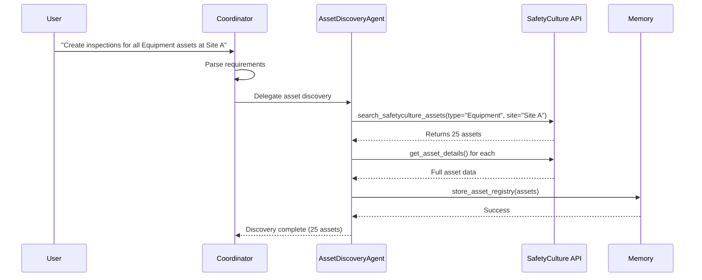
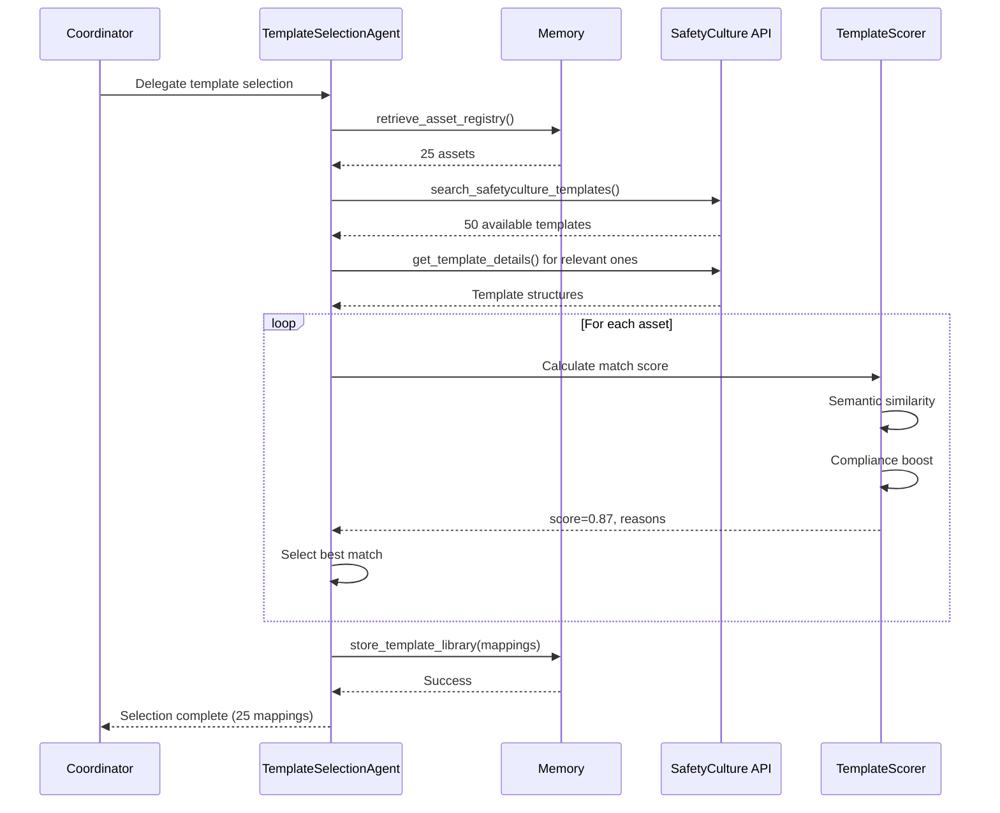
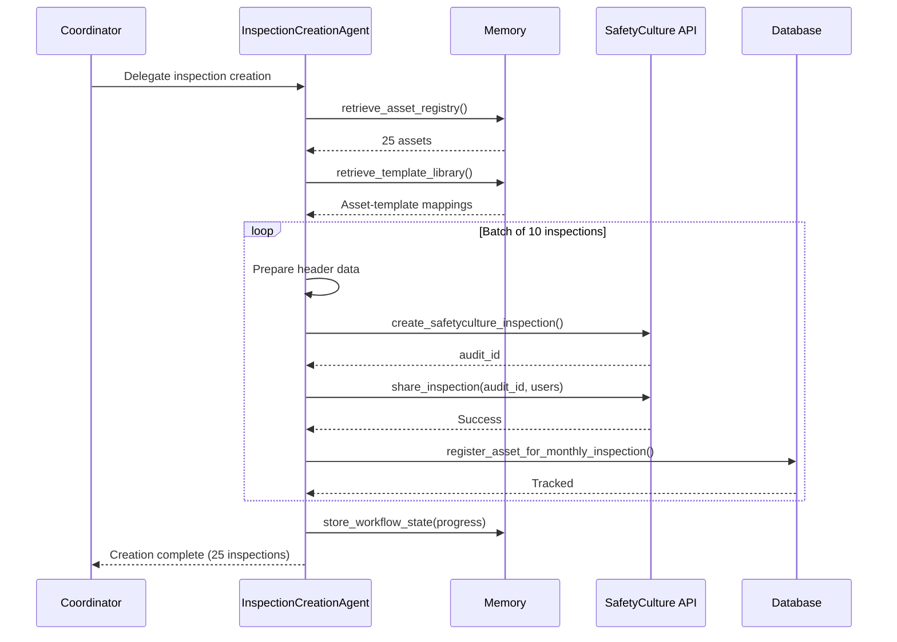
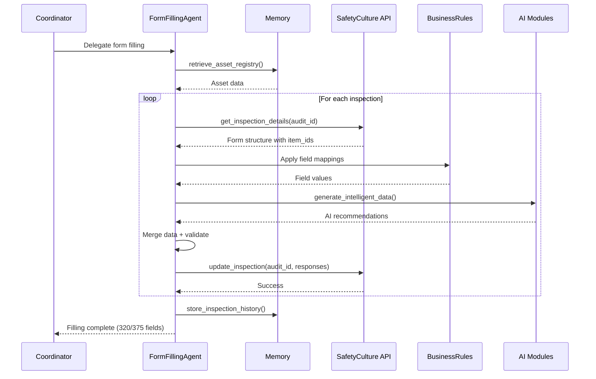
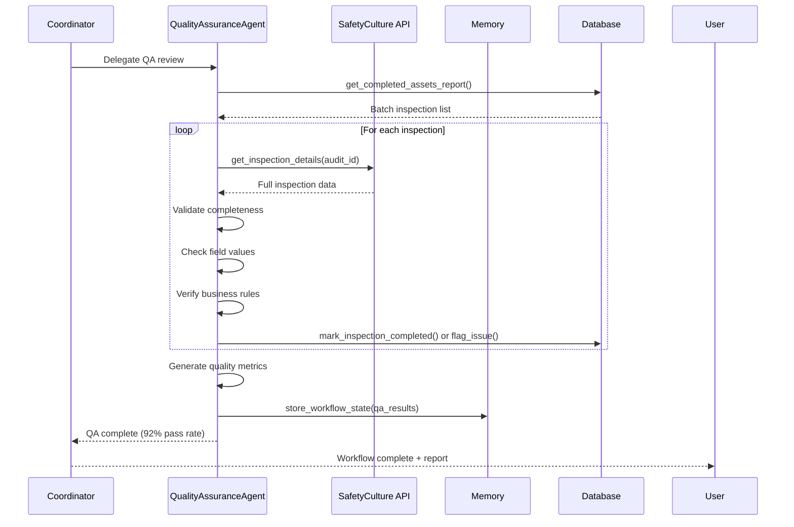
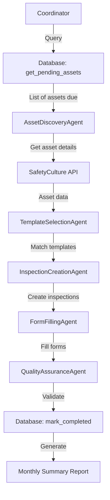
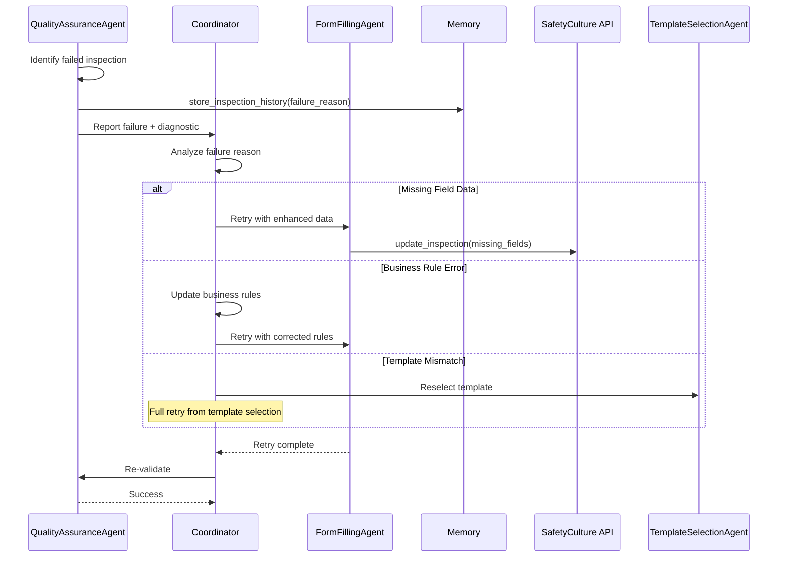

# SafetyCulture Agent - Sub-Agent Workflows

> **Version:** 1.0  
> **Last Updated:** 2025-10-03  
> **Related Documentation:** [`TOOLS_DOCUMENTATION.md`](TOOLS_DOCUMENTATION.md), [`agent.py`](safetyculture_agent/agent.py)

## Table of Contents

- [Architecture Overview](#architecture-overview)
- [Agent Roles & Responsibilities](#agent-roles--responsibilities)
- [Complete Workflows](#complete-workflows)
- [Agent Communication Patterns](#agent-communication-patterns)
- [AI Enhancement Layer](#ai-enhancement-layer)
- [Error Handling & Recovery](#error-handling--recovery)
- [Performance Optimization](#performance-optimization)
- [Monitoring & Observability](#monitoring--observability)

---

## Architecture Overview

The SafetyCulture Agent implements a **hierarchical multi-agent architecture** built on Google's ADK framework. A root coordinator orchestrates 5 specialized sub-agents, each responsible for distinct phases of the inspection automation workflow.

### Architecture Diagram

```
┌─────────────────────────────────────────────────────────────────┐
│                    SafetyCultureCoordinator                      │
│                       (Root Agent)                               │
│  Model: gemini-2.0-flash-001 (Coordinator Alias)               │
│  Role: Orchestration, delegation, workflow coordination         │
│  Tools: Full access to all 32 tools + memory + AI modules       │
└───────────┬─────────────────────────────────────────────────────┘
            │
            │ Delegates to Sub-Agents
            │
    ┌───────┴───────┬──────────┬──────────┬──────────┬──────────┐
    │               │          │          │          │          │
    ▼               ▼          ▼          ▼          ▼          ▼
┌────────┐    ┌─────────┐ ┌────────┐ ┌────────┐ ┌────────┐ ┌────┐
│ Asset  │    │Template │ │Inspec- │ │  Form  │ │Quality │ │    │
│Discov- │───▶│Selec-   │▶│tion    │▶│Filling │▶│Assur-  │ │ AI │
│ery     │    │tion     │ │Creation│ │        │ │ance    │ │Enha│
│Agent   │    │Agent    │ │Agent   │ │Agent   │ │Agent   │ │nce │
└────────┘    └─────────┘ └────────┘ └────────┘ └────────┘ └────┘
   │              │           │           │           │         │
   │ Fast Model   │ Pro Model │ Fast      │ Pro Model │ Fast    │
   │ gemini-2.0   │ gemini-2.0│ Model     │ gemini-2.0│ Model   │
   │ -flash-001   │ -pro-001  │           │ -pro-001  │         │
   │              │           │           │           │         │
   └──────────────┴───────────┴───────────┴───────────┴─────────┘
                    │                                       │
                    │                                       │
                    ▼                                       ▼
         ┌────────────────────┐              ┌──────────────────────┐
         │  SafetyCulture API │              │  AI Intelligence     │
         │  - Assets          │              │  - Image Analysis    │
         │  - Templates       │              │  - Log Parsing       │
         │  - Inspections     │              │  - Pattern Detection │
         │  - Forms           │              │  - Template Scoring  │
         └────────────────────┘              └──────────────────────┘
```

### ADK Multi-Agent Pattern

This implementation leverages ADK's [`LlmAgent`](https://github.com/google/adk-python/blob/main/src/google/adk/agents/llm_agent.py) with the `sub_agents` parameter:

```python
coordinator_agent = LlmAgent(
    name="SafetyCultureCoordinator",
    sub_agents=[
        asset_discovery_agent,
        template_selection_agent,
        inspection_creation_agent,
        form_filling_agent,
        qa_agent
    ],
    # ... coordinator has all tools for direct intervention
)
```

The coordinator can:
- **Delegate** tasks to specialized sub-agents
- **Direct execute** using any tool for immediate needs
- **Monitor** sub-agent progress through output_keys
- **Recover** from sub-agent failures with fallback strategies

---

## Agent Roles & Responsibilities

### 1. SafetyCultureCoordinator (Root Agent)

**File:** [`safetyculture_agent/agent.py:164-243`](safetyculture_agent/agent.py:164)

**Role:** Orchestrates the entire inspection automation workflow by delegating to specialized sub-agents and managing overall coordination.

**Model Configuration:**
- **Alias:** `coordinator` → `gemini/fast`
- **Actual Model:** `gemini-2.0-flash-001`
- **Temperature:** 0.7
- **Max Tokens:** 8192
- **Rationale:** Fast model for quick decision-making and delegation logic

**Key Responsibilities:**
- Parse user requirements (asset types, sites, batch sizes)
- Determine optimal agent delegation sequence
- Monitor workflow progress and manage state
- Handle inter-agent communication and data passing
- Recover from failures and implement retry logic
- Provide status updates to users

**Tools Available:** All 32 tools including:
- SafetyCulture API tools (9 tools)
- Memory management tools (7 tools)
- AI enhancement tools (6 tools)
- Database tracking tools (10 tools)

**Decision-Making Logic:**
```
User Request → Parse Requirements → Identify Workflow Type
    │
    ├─ New Asset Inspection → Asset Discovery → Template Selection → ...
    ├─ Scheduled Maintenance → Database Query → Asset Discovery → ...
    ├─ Quality Review → QA Agent Direct Invocation
    └─ Batch Processing → Parallel delegation with batching
```

**State Management:**
```python
before_agent_callback=update_current_time  # Updates workflow state
state = {
    '_time': '2025-10-03T20:57:44.637Z',
    '_workflow_started': True
}
```

---

### 2. AssetDiscoveryAgent

**File:** [`safetyculture_agent/agents/asset_discovery_agent.py`](safetyculture_agent/agents/asset_discovery_agent.py:32)

**Role:** Discovers and catalogs SafetyCulture assets based on search criteria and business rules.

**Model Configuration:**
- **Alias:** `discovery` → `gemini/fast`
- **Actual Model:** `gemini-2.0-flash-001`
- **Rationale:** Asset discovery is straightforward API interaction requiring fast response

**Key Responsibilities:**
1. Search for assets using filters (type, site, status)
2. Retrieve detailed asset information
3. Apply business rules to filter relevant assets
4. Store discovered assets in memory for downstream agents
5. Generate asset discovery summaries

**Tools Used:**
- [`search_safetyculture_assets()`](TOOLS_DOCUMENTATION.md#1-search_safetyculture_assets)
- [`get_safetyculture_asset_details()`](TOOLS_DOCUMENTATION.md#2-get_safetyculture_asset_details)
- [`store_asset_registry()`](TOOLS_DOCUMENTATION.md#10-store_asset_registry)
- [`retrieve_asset_registry()`](TOOLS_DOCUMENTATION.md#11-retrieve_asset_registry)

**Input Requirements:**
```python
{
    "search_criteria": {
        "asset_types": ["Equipment", "Vehicle"],
        "site_ids": ["site_123"],
        "include_archived": False
    },
    "batch_size": 50
}
```

**Output Format:**
```python
{
    "discovered_assets": [
        {
            "id": "asset_123",
            "name": "Compressor A-101",
            "type": "Equipment",
            "site": "Manufacturing Plant 1",
            "custom_fields": {...}
        }
    ],
    "total_count": 25,
    "memory_key": "asset_registry_2025_10_03"
}
```

**Success Criteria:**
- At least 1 asset discovered matching criteria
- Asset details fully populated
- Data stored in memory successfully
- Summary generated for coordinator

---

### 3. TemplateSelectionAgent

**File:** [`safetyculture_agent/agents/template_selection_agent.py`](safetyculture_agent/agents/template_selection_agent.py:33)

**Role:** Matches optimal inspection templates to discovered assets using AI-powered scoring.

**Model Configuration:**
- **Alias:** `template_selection` → `gemini/pro`
- **Actual Model:** `gemini-2.0-pro-001`
- **Temperature:** 0.5
- **Rationale:** Template matching requires complex reasoning about template-asset compatibility

**Key Responsibilities:**
1. Retrieve discovered assets from memory
2. Search for available templates
3. Analyze template structure and requirements
4. Use AI scoring to match templates to asset types
5. Apply compliance requirements
6. Store template mappings in memory

**Tools Used:**
- [`search_safetyculture_templates()`](TOOLS_DOCUMENTATION.md#3-search_safetyculture_templates)
- [`get_safetyculture_template_details()`](TOOLS_DOCUMENTATION.md#4-get_safetyculture_template_details)
- [`store_template_library()`](TOOLS_DOCUMENTATION.md#12-store_template_library)
- [`retrieve_template_library()`](TOOLS_DOCUMENTATION.md#13-retrieve_template_library)
- [`retrieve_asset_registry()`](TOOLS_DOCUMENTATION.md#11-retrieve_asset_registry)

**AI Enhancement:**
Uses [`TemplateScorer`](safetyculture_agent/ai/template_scoring.py:31) for intelligent matching:

```python
# Scoring algorithm considers:
- Semantic similarity between asset type and template
- Compliance requirements (OSHA, ASME, NFPA, etc.)
- Asset criticality alignment
- Template field complexity
- Historical success patterns
```

**Matching Logic:**
```
For each asset:
    1. Retrieve asset type and compliance requirements
    2. Search templates with compatible metadata
    3. Calculate similarity scores using TemplateScorer
    4. Apply compliance boost (0.0 to 0.3)
    5. Rank templates by final score
    6. Select top match (score > 0.6 threshold)
    7. Store mapping: asset_id → template_id
```

**Output Format:**
```python
{
    "selected_templates": {
        "asset_123": {
            "template_id": "template_789",
            "template_name": "Equipment Safety Inspection",
            "match_score": 0.87,
            "match_reasons": [
                "High semantic similarity",
                "Supports OSHA 29 CFR compliance",
                "Designed for equipment assets"
            ]
        }
    },
    "memory_key": "template_mappings_2025_10_03"
}
```

---

### 4. InspectionCreationAgent

**File:** [`safetyculture_agent/agents/inspection_creation_agent.py`](safetyculture_agent/agents/inspection_creation_agent.py:34)

**Role:** Creates new inspections from templates with intelligent pre-filling of header information.

**Model Configuration:**
- **Alias:** `inspection_creation` → `gemini/fast`
- **Actual Model:** `gemini-2.0-flash-001`
- **Rationale:** Inspection creation is structured API interaction with predictable patterns

**Key Responsibilities:**
1. Retrieve asset-template mappings from memory
2. Create inspections via SafetyCulture API
3. Pre-fill header information from asset data
4. Generate meaningful inspection titles
5. Assign inspections to users/groups
6. Track creation status for batch operations

**Tools Used:**
- [`create_safetyculture_inspection()`](TOOLS_DOCUMENTATION.md#5-create_safetyculture_inspection)
- [`share_safetyculture_inspection()`](TOOLS_DOCUMENTATION.md#8-share_safetyculture_inspection)
- [`get_safetyculture_inspection_details()`](TOOLS_DOCUMENTATION.md#7-get_safetyculture_inspection_details)
- [`retrieve_asset_registry()`](TOOLS_DOCUMENTATION.md#11-retrieve_asset_registry)
- [`retrieve_template_library()`](TOOLS_DOCUMENTATION.md#13-retrieve_template_library)
- [`store_workflow_state()`](TOOLS_DOCUMENTATION.md#14-store_workflow_state)

**Pre-fill Strategy:**
```python
# Header information populated:
inspection = {
    "template_id": template_id,
    "header": {
        "title": f"{asset_type} Inspection - {asset_name}",
        "conducted_on": current_datetime,
        "prepared_by": user_id,
        "location": asset_site,
        # Asset reference
        "items": {
            "asset_id": asset_id,
            "asset_name": asset_name,
            "asset_type": asset_type
        }
    }
}
```

**Batch Processing:**
- Creates inspections in configurable batch sizes (default: 10)
- Implements exponential backoff for rate limiting
- Tracks progress: `{created: 7, failed: 0, total: 10}`
- Updates workflow state after each batch

**Output Format:**
```python
{
    "created_inspections": [
        {
            "audit_id": "audit_abc123",
            "template_id": "template_789",
            "asset_id": "asset_123",
            "title": "Equipment Inspection - Compressor A-101",
            "status": "created",
            "shared_with": ["user_456"]
        }
    ],
    "batch_summary": {
        "total": 25,
        "created": 25,
        "failed": 0
    }
}
```

---

### 5. FormFillingAgent

**File:** [`safetyculture_agent/agents/form_filling_agent.py`](safetyculture_agent/agents/form_filling_agent.py:34)

**Role:** Automatically populates inspection form fields using asset data, business rules, and AI insights.

**Model Configuration:**
- **Alias:** `form_filling` → `gemini/pro`
- **Actual Model:** `gemini-2.0-pro-001`
- **Temperature:** 0.5
- **Rationale:** Form filling requires complex reasoning about field types, business rules, and data validation

**Key Responsibilities:**
1. Retrieve inspection form structure
2. Match asset properties to form fields
3. Apply business rules for automatic population
4. Handle diverse field types (text, date, checkbox, signature)
5. Validate data before submission
6. Store inspection history for learning

**Tools Used:**
- [`update_safetyculture_inspection()`](TOOLS_DOCUMENTATION.md#6-update_safetyculture_inspection)
- [`get_safetyculture_inspection_details()`](TOOLS_DOCUMENTATION.md#7-get_safetyculture_inspection_details)
- [`retrieve_asset_registry()`](TOOLS_DOCUMENTATION.md#11-retrieve_asset_registry)
- [`retrieve_template_library()`](TOOLS_DOCUMENTATION.md#13-retrieve_template_library)
- [`store_workflow_state()`](TOOLS_DOCUMENTATION.md#14-store_workflow_state)
- [`store_inspection_history()`](TOOLS_DOCUMENTATION.md#15-store_inspection_history)

**Business Rules Engine:**

Configured in [`business_rules.yaml`](safetyculture_agent/config/business_rules.yaml):

```yaml
field_mappings:
  - source: asset.id
    target: field_label:Asset ID
    
  - source: asset.type
    target: field_label:Asset Type
    
  - source: asset.site.name
    target: field_label:Site Location
    
  - source: current_datetime
    target: field_label:Inspection Date
    type: datetime
    
  - source: asset.custom_fields.serial_number
    target: field_label:Serial Number
```

**Field Type Handling:**
```python
field_handlers = {
    'text': lambda val: str(val),
    'textsingle': lambda val: str(val),
    'datetime': lambda val: datetime.now().isoformat(),
    'checkbox': lambda val: True if val else False,
    'signature': lambda val: {"name": conductor_name},
    'media': lambda val: None,  # Skip - requires manual input
}
```

**AI-Powered Enhancement:**

Form filling can be enhanced with AI-generated data:

```python
# AI modules provide intelligent defaults:
ai_data = await generate_intelligent_inspection_data(
    asset=asset_data,
    template=template_structure,
    image_analysis=visual_inspection_results,
    historical_patterns=past_inspections
)

# AI data includes:
- Visual condition assessment from image analysis
- Predicted maintenance needs
- Historical issue patterns
- Intelligent recommendations
```

**Output Format:**
```python
{
    "filled_inspections": [
        {
            "audit_id": "audit_abc123",
            "fields_populated": 12,
            "fields_total": 15,
            "fields_skipped": 3,  # Manual input required
            "validation_status": "passed"
        }
    ],
    "summary": {
        "total_fields": 375,
        "auto_filled": 320,
        "requires_manual": 55
    }
}
```

---

### 6. QualityAssuranceAgent

**File:** [`safetyculture_agent/agent.py:107-160`](safetyculture_agent/agent.py:107)

**Role:** Reviews completed inspection workflows, validates data quality, and generates quality reports.

**Model Configuration:**
- **Alias:** `qa` → `gemini/fast`
- **Actual Model:** `gemini-2.0-flash-001`
- **Rationale:** QA review involves structured validation with clear pass/fail criteria

**Key Responsibilities:**
1. Review completed inspections for completeness
2. Validate business rule application
3. Check data consistency across batch
4. Identify workflow issues and anomalies
5. Generate quality metrics and reports
6. Store lessons learned for improvement

**Tools Used:**
- All SafetyCulture API tools for inspection review
- Memory tools for historical comparison
- Database tools for completion tracking

**Validation Checks:**
```python
qa_checks = [
    # Completeness checks
    "All required fields populated",
    "Asset-template matching correct",
    "Header information accurate",
    
    # Consistency checks
    "Field values within expected ranges",
    "Date/time values logical",
    "Asset references valid",
    
    # Business rule checks
    "Field mappings applied correctly",
    "Compliance requirements met",
    "Workflow sequence followed"
]
```

**Quality Report Format:**
```python
{
    "quality_report": {
        "batch_id": "batch_2025_10_03",
        "total_inspections": 25,
        "passed": 23,
        "failed": 2,
        "quality_score": 0.92,
        
        "metrics": {
            "avg_fields_populated": 12.8,
            "avg_completion_time": "45 seconds",
            "error_rate": 0.08
        },
        
        "issues_found": [
            {
                "inspection_id": "audit_xyz",
                "issue": "Missing required signature",
                "severity": "high"
            }
        ],
        
        "recommendations": [
            "Add signature field validation",
            "Improve field mapping for custom fields"
        ]
    }
}
```

---

## Complete Workflows

### Workflow 1: New Asset Inspection (End-to-End)

**Trigger:** User requests inspection of newly discovered assets

**Duration:** ~2-5 minutes for 25 assets (depending on API rate limits)

#### Phase 1: Asset Discovery



**Data Flow:**
```python
# Coordinator → AssetDiscoveryAgent
{
    "task": "discover_assets",
    "filters": {
        "asset_type": "Equipment",
        "site": "Site A"
    }
}

# AssetDiscoveryAgent → Memory
{
    "key": "asset_registry_2025_10_03_123456",
    "assets": [
        {
            "id": "asset_001",
            "name": "Compressor A-101",
            "type": "Equipment",
            "site": {"name": "Site A"},
            "criticality": "high"
        },
        # ... 24 more assets
    ]
}

# AssetDiscoveryAgent → Coordinator
{
    "status": "success",
    "discovered_count": 25,
    "memory_key": "asset_registry_2025_10_03_123456",
    "output_key": "discovered_assets"
}
```

---

#### Phase 2: Template Selection with AI Scoring



**AI Scoring Process:**

```python
# For asset "Compressor A-101" (type: Equipment, criticality: High)
templates = [
    {"id": "t1", "name": "Equipment Safety Inspection"},
    {"id": "t2", "name": "General Asset Check"},
    {"id": "t3", "name": "HVAC System Inspection"}
]

# TemplateScorer calculates:
for template in templates:
    # Base similarity (0.0 to 1.0)
    semantic_score = calculate_similarity(
        asset_type="Equipment",
        template_name=template["name"]
    )
    
    # Compliance boost (0.0 to 0.3)
    compliance_boost = calculate_compliance_boost(
        asset_requirements=["OSHA 29 CFR", "ASME standards"],
        template_fields=template["items"]
    )
    
    final_score = semantic_score + compliance_boost
    
# Results:
t1_score = 0.85 + 0.15 = 1.00  # ✓ Selected
t2_score = 0.60 + 0.05 = 0.65
t3_score = 0.30 + 0.00 = 0.30
```

---

#### Phase 3: Inspection Creation with Pre-filling



**Header Pre-filling Logic:**

```python
# For each asset-template pair:
asset = {
    "id": "asset_001",
    "name": "Compressor A-101",
    "type": "Equipment",
    "site": {"name": "Manufacturing Plant 1"},
    "custom_fields": {
        "serial_number": "SN-98765",
        "install_date": "2020-01-15"
    }
}

template = {
    "id": "template_789",
    "name": "Equipment Safety Inspection"
}

# Generate inspection with pre-filled header:
inspection = {
    "template_id": "template_789",
    "header": {
        "title": "Equipment Inspection - Compressor A-101",
        "conducted_on": "2025-10-03T13:45:00Z",
        "prepared_by": user_id,
        "location": {
            "name": "Manufacturing Plant 1"
        }
    },
    "items": {
        # Asset reference fields (pre-filled)
        "asset_id_field": "asset_001",
        "asset_name_field": "Compressor A-101",
        "asset_type_field": "Equipment",
        "serial_number_field": "SN-98765"
    }
}
```

**Batch Processing with Rate Limiting:**

```python
# InspectionCreationAgent handles batching:
batch_size = 10
rate_limit = 5 req/sec  # SafetyCulture API limit

for batch in chunks(asset_template_pairs, batch_size):
    for asset, template in batch:
        try:
            # Create with exponential backoff
            audit_id = await create_inspection_with_retry(
                template_id=template["id"],
                header=generate_header(asset)
            )
            
            # Share with users
            await share_inspection(audit_id, user_list)
            
            # Track in database
            await db.register_asset_for_monthly_inspection(
                asset_id=asset["id"],
                inspection_id=audit_id
            )
            
            created_count += 1
            
        except RateLimitError:
            await asyncio.sleep(backoff_time)
            backoff_time *= 2  # Exponential backoff
            
    # Update progress
    store_workflow_state({
        "created": created_count,
        "total": total_count
    })
```

---

#### Phase 4: Form Filling with Business Rules



**Field Mapping Example:**

```python
# Business rule from config/business_rules.yaml:
field_mapping = {
    "source": "asset.custom_fields.serial_number",
    "target": "field_label:Serial Number",
    "required": True
}

# Form structure from API:
form_items = [
    {
        "item_id": "item_123",
        "label": "Serial Number",
        "type": "text",
        "required": True
    },
    {
        "item_id": "item_124",
        "label": "Inspection Date",
        "type": "datetime",
        "required": True
    }
]

# FormFillingAgent applies mapping:
responses = {
    "item_123": {  # Serial Number field
        "text": "SN-98765",  # From asset.custom_fields.serial_number
        "type": "text"
    },
    "item_124": {  # Inspection Date field
        "datetime": "2025-10-03T13:45:00Z",  # Current datetime
        "type": "datetime"
    }
}

# Update via API:
update_safetyculture_inspection(
    audit_id="audit_abc123",
    responses=responses
)
```

**AI-Enhanced Form Filling:**

```python
# Optional: Use AI to generate intelligent responses
ai_data = await generate_intelligent_inspection_data(
    asset={
        "id": "asset_001",
        "type": "Equipment",
        "criticality": "high"
    },
    template=template_structure,
    image_analysis=await analyze_asset_image(asset_image),
    historical_patterns=await analyze_historical_patterns(asset_id)
)

# AI provides:
{
    "visual_condition": "Good - minor surface corrosion",
    "safety_concerns": "Exposed wiring near junction box",
    "maintenance_recommendations": "Tighten terminal connections; Apply anti-corrosion coating",
    "next_inspection_date": "2025-11-03",
    "predicted_issues": ["Bearing wear", "Belt tension"]
}

# Merge with standard field mappings:
responses = {
    **standard_field_responses,
    "condition_field": ai_data["visual_condition"],
    "recommendations_field": ai_data["maintenance_recommendations"]
}
```

---

#### Phase 5: Quality Assurance Review



**Validation Logic:**

```python
# QualityAssuranceAgent validation checks:
def validate_inspection(inspection):
    issues = []
    
    # 1. Completeness check
    required_fields = get_required_fields(inspection["template_id"])
    for field in required_fields:
        if field["item_id"] not in inspection["responses"]:
            issues.append({
                "type": "missing_field",
                "field": field["label"],
                "severity": "high"
            })
    
    # 2. Business rule validation
    for response in inspection["responses"]:
        expected_mapping = find_business_rule(response["item_id"])
        if expected_mapping:
            if not validate_mapping(response, expected_mapping):
                issues.append({
                    "type": "incorrect_mapping",
                    "field": response["label"],
                    "severity": "medium"
                })
    
    # 3. Data consistency
    if "inspection_date" in responses:
        date = parse_date(responses["inspection_date"])
        if date > datetime.now():
            issues.append({
                "type": "future_date",
                "field": "Inspection Date",
                "severity": "high"
            })
    
    # 4. Asset reference validation
    asset_id_response = find_response_by_label("Asset ID")
    if asset_id_response:
        if not asset_exists(asset_id_response["value"]):
            issues.append({
                "type": "invalid_asset_reference",
                "severity": "critical"
            })
    
    return issues
```

**Final Report Generation:**

```python
{
    "workflow_summary": {
        "batch_id": "batch_2025_10_03_123456",
        "started": "2025-10-03T13:40:00Z",
        "completed": "2025-10-03T13:45:00Z",
        "duration": "5 minutes",
        
        "asset_discovery": {
            "assets_found": 25,
            "memory_key": "asset_registry_2025_10_03_123456"
        },
        
        "template_selection": {
            "templates_matched": 25,
            "avg_match_score": 0.87,
            "memory_key": "template_mappings_2025_10_03_123456"
        },
        
        "inspection_creation": {
            "inspections_created": 25,
            "failed": 0,
            "avg_creation_time": "2.3 seconds"
        },
        
        "form_filling": {
            "total_fields": 375,
            "auto_filled": 320,
            "requires_manual": 55,
            "success_rate": "85%"
        },
        
        "quality_assurance": {
            "inspections_reviewed": 25,
            "passed": 23,
            "failed": 2,
            "quality_score": 0.92,
            "issues": [
                {
                    "inspection": "audit_xyz",
                    "issue": "Missing signature"
                },
                {
                    "inspection": "audit_abc",
                    "issue": "Invalid date format"
                }
            ]
        }
    },
    
    "recommendations": [
        "Add signature field to template",
        "Improve date format validation",
        "Consider pre-populating more fields for 85%→95% automation"
    ]
}
```

---

### Workflow 2: Scheduled Monthly Inspection

**Trigger:** Automated schedule or user request for monthly inspections

**Key Difference:** Starts with database query to identify assets due for inspection

#### Workflow Sequence



**Database-Driven Discovery:**

```python
# Phase 0: Database query (before asset discovery)
pending_assets = await db.get_pending_assets_for_inspection(
    inspection_type="monthly",
    due_date_before=datetime.now() + timedelta(days=7)
)

# Returns:
[
    {
        "asset_id": "asset_001",
        "last_inspection": "2024-09-03",
        "next_due": "2025-10-03",
        "days_overdue": 0,
        "priority": "high"
    },
    # ... more assets
]

# Coordinator delegates to AssetDiscoveryAgent with specific IDs:
coordinator.delegate_to(
    agent=asset_discovery_agent,
    task={
        "action": "get_details",
        "asset_ids": [a["asset_id"] for a in pending_assets]
    }
)
```

**Monthly Summary Generation:**

```python
# After QA phase:
monthly_summary = await db.get_monthly_inspection_summary(
    month="2025-10",
    organization_id=org_id
)

# Generates comprehensive report:
{
    "period": "2025-10",
    "total_assets": 150,
    "inspections_required": 45,  # Monthly schedule
    "inspections_completed": 43,
    "inspections_overdue": 2,
    "completion_rate": "95.6%",
    
    "by_asset_type": {
        "Equipment": {"required": 20, "completed": 19},
        "Vehicle": {"required": 15, "completed": 15},
        "Infrastructure": {"required": 10, "completed": 9}
    },
    
    "by_site": {
        "Site A": {"required": 25, "completed": 25},
        "Site B": {"required": 20, "completed": 18}
    },
    
    "quality_metrics": {
        "avg_completion_time": "3.2 minutes",
        "auto_fill_rate": "87%",
        "qa_pass_rate": "94%"
    }
}

# Export to report:
report_path = await db.export_comprehensive_monthly_report(
    summary=monthly_summary,
    format="PDF"
)
```

---

### Workflow 3: Failed Inspection Retry with Learning

**Trigger:** QA agent identifies failed inspections requiring correction

**Key Features:**
- Feedback loop from QA to form filling
- Learning from failures
- Targeted re-execution

#### Workflow Sequence



**Failure Analysis and Learning:**

```python
# QA identifies failure:
failure = {
    "inspection_id": "audit_xyz",
    "failure_reason": "missing_required_field",
    "field_label": "Inspector Signature",
    "field_id": "item_789"
}

# Store for learning:
await store_inspection_history({
    "inspection_id": failure["inspection_id"],
    "status": "failed",
    "reason": failure["failure_reason"],
    "corrective_action_needed": True
})

# Coordinator analyzes:
if failure["failure_reason"] == "missing_required_field":
    # Check if business rule exists for this field
    rule = find_business_rule(field_label=failure["field_label"])
    
    if not rule:
        # Add new business rule
        add_business_rule({
            "source": "conductor.name",
            "target": f"field_label:{failure['field_label']}",
            "type": "signature",
            "required": True
        })
    
    # Retry with enhanced data
    coordinator.delegate_to(
        agent=form_filling_agent,
        task={
            "action": "retry_inspection",
            "inspection_id": failure["inspection_id"],
            "focus_fields": [failure["field_id"]],
            "enhanced_data": {
                "conductor_name": current_user_name
            }
        }
    )
```

**Learning Patterns:**

```python
# Pattern detector analyzes failures:
failure_patterns = await pattern_detector.analyze_historical_patterns(
    asset_id=None,  # Analyze across all assets
    inspection_history=failed_inspections
)

# Identifies:
{
    "common_failure_reasons": [
        {"reason": "missing_signature", "count": 15},
        {"reason": "invalid_date_format", "count": 8},
        {"reason": "asset_id_mismatch", "count": 3}
    ],
    
    "recommendations": [
        "Add signature field to all templates",
        "Implement date format validation pre-submission",
        "Improve asset reference validation"
    ]
}

# Coordinator stores learning:
await memory.store_workflow_state({
    "key": "failure_patterns_analysis",
    "patterns": failure_patterns,
    "timestamp": datetime.now().isoformat(),
    "action_items": failure_patterns["recommendations"]
})
```

---

## Agent Communication Patterns

### Pattern 1: Sequential Delegation (Primary Pattern)

**Use Case:** Standard workflow where each phase depends on previous phase completion

```python
# Coordinator orchestration:
async def execute_sequential_workflow(user_request):
    # Phase 1: Asset Discovery
    discovered_assets = await coordinator.delegate_to(
        agent=asset_discovery_agent,
        input={"search_criteria": parse_criteria(user_request)}
    )
    
    # Wait for completion, check output
    if not discovered_assets or discovered_assets["count"] == 0:
        return "No assets found matching criteria"
    
    # Phase 2: Template Selection (depends on Phase 1)
    selected_templates = await coordinator.delegate_to(
        agent=template_selection_agent,
        input={
            "asset_memory_key": discovered_assets["memory_key"]
        }
    )
    
    # Phase 3: Inspection Creation (depends on Phase 2)
    created_inspections = await coordinator.delegate_to(
        agent=inspection_creation_agent,
        input={
            "asset_memory_key": discovered_assets["memory_key"],
            "template_memory_key": selected_templates["memory_key"]
        }
    )
    
    # Phase 4: Form Filling (depends on Phase 3)
    filled_inspections = await coordinator.delegate_to(
        agent=form_filling_agent,
        input={
            "inspection_ids": created_inspections["audit_ids"],
            "asset_memory_key": discovered_assets["memory_key"]
        }
    )
    
    # Phase 5: QA Review (depends on Phase 4)
    qa_report = await coordinator.delegate_to(
        agent=qa_agent,
        input={
            "inspection_ids": filled_inspections["audit_ids"]
        }
    )
    
    return qa_report
```

**Memory as Coordination Mechanism:**

```python
# Each agent stores results in memory with unique key:
# Agent 1 stores:
await memory.store("asset_registry_123", asset_data)

# Agent 2 retrieves:
asset_data = await memory.retrieve("asset_registry_123")

# Benefits:
# - Decouples agents (no direct dependencies)
# - Enables retry without re-execution
# - Supports parallel workflows (different memory keys)
# - Facilitates debugging (inspect memory state)
```

---

### Pattern 2: Parallel Processing with Aggregation

**Use Case:** Processing multiple assets simultaneously for faster batch operations

```python
# Coordinator splits work across parallel instances:
async def execute_parallel_workflow(asset_list):
    # Split assets into batches
    batches = chunk_list(asset_list, batch_size=10)
    
    # Create parallel tasks
    tasks = []
    for batch in batches:
        task = coordinator.delegate_to(
            agent=form_filling_agent,
            input={
                "asset_batch": batch,
                "parallel_id": f"batch_{batch.index}"
            }
        )
        tasks.append(task)
    
    # Wait for all to complete
    results = await asyncio.gather(*tasks, return_exceptions=True)
    
    # Aggregate results
    total_success = sum(r["success_count"] for r in results if not isinstance(r, Exception))
    total_failed = sum(r["failed_count"] for r in results if not isinstance(r, Exception))
    
    return {
        "total_processed": len(asset_list),
        "successful": total_success,
        "failed": total_failed,
        "batches_completed": len(results)
    }
```

**Rate Limiting Coordination:**

```python
# Coordinator manages global rate limits:
class CoordinatorRateLimiter:
    def __init__(self):
        self.rate_limiter = RateLimiter(
            max_requests=5,
            time_window=1.0  # 5 req/sec
        )
        self.circuit_breaker = CircuitBreaker(
            failure_threshold=5,
            recovery_timeout=60
        )
    
    async def delegate_with_limit(self, agent, task):
        # Check circuit breaker
        if self.circuit_breaker.is_open():
            raise Exception("Circuit breaker open - too many failures")
        
        # Apply rate limit
        await self.rate_limiter.acquire()
        
        try:
            result = await agent.execute(task)
            self.circuit_breaker.record_success()
            return result
        except Exception as e:
            self.circuit_breaker.record_failure()
            raise
```

---

### Pattern 3: Feedback Loops for Continuous Improvement

**Use Case:** QA agent provides feedback to improve form filling accuracy

```python
# QA agent generates feedback:
qa_feedback = {
    "inspection_id": "audit_123",
    "issues": [
        {
            "field": "Inspector Signature",
            "issue": "Field not populated",
            "suggested_fix": "Add signature mapping rule"
        }
    ]
}

# Store in memory:
await memory.store_workflow_state({
    "key": "qa_feedback_batch_123",
    "feedback": qa_feedback
})

# Coordinator reads feedback before next batch:
previous_feedback = await memory.retrieve_workflow_state(
    "qa_feedback_batch_122"
)

# Apply learnings:
if previous_feedback:
    enhanced_business_rules = apply_feedback(
        current_rules=business_rules,
        feedback=previous_feedback
    )
    
    # Next form filling uses enhanced rules
    await coordinator.delegate_to(
        agent=form_filling_agent,
        input={
            "business_rules": enhanced_business_rules,
            "learn_from_feedback": True
        }
    )
```

---

### Pattern 4: Conditional Branching Based on Agent Output

**Use Case:** Coordinator makes decisions based on sub-agent results

```python
# After template selection:
template_results = await coordinator.delegate_to(template_selection_agent, ...)

# Check match quality:
for asset_id, template_match in template_results["matches"].items():
    if template_match["match_score"] < 0.6:
        # Low confidence match - need human review
        coordinator.flag_for_manual_review({
            "asset_id": asset_id,
            "reason": "Low template match confidence",
            "score": template_match["match_score"]
        })
        
    elif template_match["match_score"] < 0.8:
        # Medium confidence - use AI to generate custom template
        custom_template = await coordinator.call_tool(
            tool=generate_dynamic_template_for_asset,
            params={
                "asset_id": asset_id,
                "base_template": template_match["template_id"]
            }
        )
        # Update match with custom template
        template_results["matches"][asset_id] = custom_template
        
    else:
        # High confidence - proceed as normal
        pass

# Continue with updated template selections:
await coordinator.delegate_to(inspection_creation_agent, template_results)
```

---

## AI Enhancement Layer

The SafetyCulture Agent integrates 4 specialized AI modules that enhance agent capabilities:

### 1. Form Intelligence (`EnhancedFormIntelligence`)

**File:** [`safetyculture_agent/ai/form_intelligence.py`](safetyculture_agent/ai/form_intelligence.py:45)

**Purpose:** Facade coordinating image analysis, log parsing, and pattern detection

**Used By:** FormFillingAgent, QualityAssuranceAgent

**Capabilities:**
```python
form_intelligence = EnhancedFormIntelligence()

# Coordinate all AI analysis:
intelligent_data = await form_intelligence.generate_intelligent_form_data(
    asset=asset_data,
    template=template_structure,
    image_analysis=image_results,
    maintenance_logs=parsed_logs,
    historical_patterns=patterns
)

# Returns comprehensive data:
{
    "asset_id": "asset_001",
    "visual_condition": "Good - minor corrosion",
    "visible_damage": "Surface rust on housing",
    "safety_concerns": "Exposed wiring near junction",
    "recent_maintenance": "Lubrication, Filter replacement",
    "known_issues": "Bearing wear, Belt tension",
    "condition_trend": "Asset condition stable",
    "recurring_issues": "Watch for: corrosion, loose connections",
    "ai_recommendations": "Apply anti-corrosion coating; Tighten connections",
    "next_inspection_date": "2025-11-03"
}
```

---

### 2. Image Analyzer (`ImageAnalyzer`)

**File:** [`safetyculture_agent/ai/image_analyzer.py`](safetyculture_agent/ai/image_analyzer.py:56)

**Purpose:** Computer vision for asset visual inspection

**Used By:** FormFillingAgent via AI tools

**Integration Point:**
```python
# FormFillingAgent can request image analysis:
if asset_has_image(asset):
    image_analysis = await coordinator.call_tool(
        tool=analyze_asset_image_for_inspection,
        params={
            "image_path": asset["image_url"],
            "asset_type": asset["type"]
        }
    )
    
    # Use analysis results in form:
    form_data["visual_condition"] = image_analysis["asset_condition"]
    form_data["damage_notes"] = ", ".join(image_analysis["visible_damage"])
    form_data["safety_concerns"] = ", ".join(image_analysis["safety_concerns"])
```

**Simulated Analysis (Production: Google Cloud Vision API):**
```python
# Current implementation simulates CV for development:
ImageAnalysisResult(
    asset_condition="good",  # excellent/good/fair/poor/critical
    visible_damage=["Minor surface corrosion on housing"],
    safety_concerns=["Exposed wiring near junction box"],
    maintenance_indicators=["Terminal connections need tightening"],
    confidence_score=0.85,
    extracted_text=["DANGER HIGH VOLTAGE", "Model: XYZ-123"]
)

# Production integration:
"""
from google.cloud import vision

client = vision.ImageAnnotatorClient()
image = vision.Image(content=image_bytes)

# Object detection
objects = client.object_localization(image=image).localized_object_annotations

# Text detection (OCR)
texts = client.text_detection(image=image).text_annotations

# Label detection (condition assessment)
labels = client.label_detection(image=image).label_annotations
"""
```

---

### 3. Pattern Detector (`PatternDetector`)

**File:** [`safetyculture_agent/ai/pattern_detector.py`](safetyculture_agent/ai/pattern_detector.py:77)

**Purpose:** Historical inspection data analysis for trend identification

**Used By:** QualityAssuranceAgent, FormFillingAgent

**Pattern Types Detected:**

1. **Inspection Frequency Patterns:**
```python
# Analyzes historical inspection dates:
HistoricalPattern(
    pattern_type="inspection_frequency",
    frequency="monthly",  # monthly/quarterly/semi-annually/annually
    typical_values={"average_days": 32},
    trend_direction="stable",
    confidence=0.8
)
```

2. **Condition Trend Patterns:**
```python
# Tracks asset condition over time:
HistoricalPattern(
    pattern_type="condition_trend",
    frequency="ongoing",
    typical_values={"average_score": 3.8},
    trend_direction="declining",  # improving/declining/stable
    confidence=0.75
)

# Informs next inspection scheduling:
if trend_direction == "declining":
    next_inspection_days *= 0.7  # Increase frequency 30%
```

3. **Common Issues Patterns:**
```python
# Identifies recurring problems:
HistoricalPattern(
    pattern_type="common_issues",
    frequency="recurring",
    typical_values={
        "issues": ["corrosion", "loose", "leak"]
    },
    trend_direction="stable",
    confidence=0.7
)

# FormFillingAgent uses for predictive fields:
form_data["watch_for"] = "Common issues: " + ", ".join(common_issues)
```

**Multi-Source Condition Assessment:**
```python
# Combines image, maintenance logs, and historical data:
overall_condition, confidence = pattern_detector.assess_condition_from_multiple_sources(
    image_condition="good",
    image_confidence=0.85,
    recent_issues_count=2,
    trend_direction="declining",
    trend_confidence=0.75
)

# Weighted scoring produces comprehensive assessment:
# - Image analysis: 40% weight
# - Maintenance logs: 30% weight  
# - Historical trend: 30% weight
# Result: "fair" (0.72 confidence)
```

---

### 4. Template Scorer (`TemplateScorer`)

**File:** [`safetyculture_agent/ai/template_scoring.py`](safetyculture_agent/ai/template_scoring.py:31)

**Purpose:** Intelligent template-to-asset matching with compliance awareness

**Used By:** TemplateSelectionAgent

**Scoring Algorithm:**
```python
template_scorer = TemplateScorer()

# Calculate match score:
def score_template_for_asset(asset, template):
    # 1. Semantic similarity (0.0 to 1.0)
    similarity = calculate_semantic_similarity(
        asset_type=asset["type"],
        asset_name=asset["name"],
        template_name=template["name"]
    )
    
    # 2. Compliance boost (0.0 to 0.3)
    compliance_requirements = template_scorer.get_compliance_requirements(
        asset["type"]
    )
    
    compliance_boost = template_scorer.calculate_compliance_boost(
        asset_compliance_requirements=compliance_requirements,
        template=template
    )
    
    # 3. Final score
    final_score = similarity + compliance_boost
    
    # 4. Generate human-readable reasons
    reasons = template_scorer.generate_match_reasons(
        asset_type=asset["type"],
        asset_criticality=asset["criticality"],
        asset_compliance_requirements=compliance_requirements,
        template=template,
        similarity_score=similarity
    )
    
    return {
        "score": final_score,
        "reasons": reasons
    }
```

**Compliance Rules Database:**
```python
# Built-in compliance standards by asset type:
{
    "pressure_vessel": [
        "ASME Boiler and Pressure Vessel Code",
        "API 510 Pressure Vessel Inspection Code",
        "OSHA 29 CFR 1910.106"
    ],
    "electrical_equipment": [
        "NFPA 70E Standard for Electrical Safety",
        "IEEE C57.12.00 Standard for Transformers",
        "OSHA 29 CFR 1910.303"
    ],
    "lifting_equipment": [
        "ASME B30.2 Overhead and Gantry Cranes",
        "OSHA 29 CFR 1926.1400 Cranes and Derricks"
    ]
}

# Template with compliance fields gets boost:
template = {
    "name": "Pressure Vessel Inspection",
    "items": [
        {"label": "ASME Compliance Check"},
        {"label": "Inspection Date"},
        {"label": "Next Inspection Due"}
    ]
}

# Boost calculation:
boost = 0.0
boost += 0.1  # Has "compliance" field
boost += 0.15  # Mentions "ASME" (matches requirement)
# Total boost: 0.25
```

---

### AI Tool Integration Points

All AI modules are exposed as ADK tools for agent use:

**Tool:** [`ai_match_templates_to_asset()`](TOOLS_DOCUMENTATION.md#17-ai_match_templates_to_asset)
```python
# TemplateSelectionAgent uses:
match_results = await ai_match_templates_to_asset(
    asset_data=asset,
    available_templates=templates
)
# Returns scored and ranked template matches
```

**Tool:** [`analyze_asset_image_for_inspection()`](TOOLS_DOCUMENTATION.md#19-analyze_asset_image_for_inspection)
```python
# FormFillingAgent uses:
image_analysis = await analyze_asset_image_for_inspection(
    image_path=asset["image_url"],
    asset_type=asset["type"]
)
# Returns visual condition assessment
```

**Tool:** [`analyze_historical_inspection_patterns()`](TOOLS_DOCUMENTATION.md#21-analyze_historical_inspection_patterns)
```python
# QualityAssuranceAgent uses:
patterns = await analyze_historical_inspection_patterns(
    asset_id=asset["id"],
    inspection_history=past_inspections
)
# Returns detected patterns and trends
```

**Tool:** [`generate_intelligent_inspection_data()`](TOOLS_DOCUMENTATION.md#22-generate_intelligent_inspection_data)
```python
# FormFillingAgent uses:
ai_data = await generate_intelligent_inspection_data(
    asset_data=asset,
    template_data=template,
    image_analysis_result=image_result,
    maintenance_logs_parsed=logs,
    historical_patterns=patterns
)
# Returns comprehensive AI-enhanced form data
```

---

## Error Handling & Recovery

### Per-Agent Error Strategies

#### 1. AssetDiscoveryAgent Error Handling

```python
# Handles API failures gracefully:
try:
    assets = await search_safetyculture_assets(filters)
except SafetyCultureAPIError as e:
    if e.status_code == 429:  # Rate limit
        logger.warning("Rate limit hit, backing off")
        await asyncio.sleep(exponential_backoff())
        assets = await search_safetyculture_assets(filters)  # Retry
    elif e.status_code == 404:
        logger.info("No assets found for criteria")
        return {"discovered_assets": [], "count": 0}
    else:
        raise  # Propagate to coordinator

# Circuit breaker integration:
with circuit_breaker:
    assets = await search_safetyculture_assets(filters)
```

**Recovery Strategy:**
- **Retry:** Exponential backoff for rate limits (1s, 2s, 4s, 8s)
- **Fallback:** Return empty list if no assets found (not an error)
- **Escalate:** Propagate authentication/permission errors to coordinator

---

#### 2. TemplateSelectionAgent Error Handling

```python
# Handles low-confidence matches:
for asset in assets:
    match = await score_template_match(asset, templates)
    
    if match["score"] < 0.4:
        # Very low confidence - cannot proceed
        logger.error(f"No suitable template for asset {asset['id']}")
        failed_matches.append({
            "asset_id": asset["id"],
            "reason": "No compatible template found",
            "action": "manual_selection_required"
        })
        
    elif match["score"] < 0.6:
        # Medium confidence - try AI generation
        logger.warning(f"Low template match for asset {asset['id']}, generating custom")
        try:
            custom_template = await generate_dynamic_template_for_asset(asset)
            match = {"template_id": custom_template["id"], "score": 0.8}
        except Exception:
            # Fallback to best available match
            match = templates[0]  # Use highest scored template
    
    successful_matches.append(match)
```

**Recovery Strategy:**
- **Generate:** Use AI to create custom template for poor matches
- **Fallback:** Select best available template even if score < 0.6
- **Flag:** Mark low-confidence matches for human review
- **Continue:** Don't fail entire batch for individual match issues

---

#### 3. InspectionCreationAgent Error Handling

```python
# Handles API errors during batch creation:
created = []
failed = []

for asset, template in asset_template_pairs:
    try:
        with rate_limiter:
            audit_id = await create_safetyculture_inspection(
                template_id=template["id"],
                header=generate_header(asset)
            )
            created.append({"asset_id": asset["id"], "audit_id": audit_id})
            
    except SafetyCultureAPIError as e:
        logger.error(f"Failed to create inspection for {asset['id']}: {e}")
        failed.append({
            "asset_id": asset["id"],
            "error": str(e),
            "retry": should_retry(e)
        })

# Retry failed with backoff:
if failed:
    await asyncio.sleep(5)
    for item in [f for f in failed if f["retry"]]:
        try:
            audit_id = await create_safetyculture_inspection(...)
            created.append({"asset_id": item["asset_id"], "audit_id": audit_id})
            failed.remove(item)
        except:
            pass  # Give up after one retry
```

**Recovery Strategy:**
- **Continue:** Don't stop batch for individual failures
- **Retry:** One retry with 5-second delay for transient errors
- **Report:** Return both successful and failed creations
- **Track:** Store failure reasons for coordinator analysis

---

#### 4. FormFillingAgent Error Handling

```python
# Handles field validation errors:
for inspection in inspections:
    try:
        responses = await generate_responses(inspection, asset_data)
        
        # Validate before submission:
        validation_errors = validate_responses(responses, template)
        if validation_errors:
            # Attempt auto-correction:
            for error in validation_errors:
                corrected = attempt_correction(error, responses)
                if corrected:
                    responses.update(corrected)
                else:
                    # Skip invalid field:
                    logger.warning(f"Cannot auto-correct field {error['field']}")
                    del responses[error["item_id"]]
        
        # Submit with remaining valid fields:
        await update_safetyculture_inspection(
            audit_id=inspection["audit_id"],
            responses=responses
        )
        
    except BusinessRuleError as e:
        logger.error(f"Business rule error: {e}")
        # Store for coordinator to fix rules:
        await store_workflow_state({
            "error_type": "business_rule",
            "inspection_id": inspection["audit_id"],
            "rule_issue": str(e)
        })
```

**Recovery Strategy:**
- **Validate:** Check field values before API submission
- **Correct:** Auto-fix common issues (date formats, type mismatches)
- **Partial:** Submit valid fields even if some fail validation
- **Learn:** Store validation errors for business rule improvement

---

### Coordinator Recovery Logic

```python
# Coordinator implements comprehensive error recovery:
class SafetyCultureCoordinator:
    async def execute_workflow(self, user_request):
        try:
            # Phase 1: Asset Discovery
            try:
                assets = await self.delegate_to(asset_discovery_agent, ...)
            except AssetDiscoveryError:
                # Try alternative search:
                assets = await self.direct_asset_search(...)
            
            if not assets:
                return "No assets found matching criteria"
            
            # Phase 2: Template Selection
            try:
                templates = await self.delegate_to(template_selection_agent, ...)
            except TemplateSelectionError as e:
                # Fallback to default template:
                templates = await self.get_default_templates(assets)
            
            # Phase 3: Inspection Creation
            try:
                inspections = await self.delegate_to(inspection_creation_agent, ...)
            except InspectionCreationError as e:
                # Retry failed inspections:
                failed_assets = e.failed_items
                if len(failed_assets) < len(assets) * 0.5:  # < 50% failed
                    # Retry failed subset:
                    retry_result = await self.retry_creation(failed_assets)
                    inspections = e.successful_items + retry_result
                else:
                    # Too many failures - escalate:
                    raise WorkflowError("Excessive creation failures")
            
            # Phase 4: Form Filling
            try:
                filled = await self.delegate_to(form_filling_agent, ...)
            except FormFillingError as e:
                # Partial success acceptable:
                if e.success_rate > 0.7:  # 70% threshold
                    filled = e.partial_results
                    logger.warning(f"Partial form filling: {e.success_rate}")
                else:
                    raise
            
            # Phase 5: QA
            qa_report = await self.delegate_to(qa_agent, ...)
            
            # Handle QA failures:
            if qa_report["failed_count"] > 0:
                # Retry failed inspections:
                await self.retry_failed_inspections(qa_report["failures"])
            
            return qa_report
            
        except WorkflowError as e:
            # Log and report to user:
            logger.error(f"Workflow failed: {e}")
            return {
                "status": "failed",
                "error": str(e),
                "partial_results": self.get_partial_results()
            }
```

---

### Circuit Breaker Integration

**File:** [`safetyculture_agent/utils/circuit_breaker.py`](safetyculture_agent/utils/circuit_breaker.py)

```python
# Circuit breaker protects against cascading failures:
circuit_breaker = CircuitBreaker(
    failure_threshold=5,  # Open after 5 failures
    recovery_timeout=60,  # Try recovery after 60 seconds
    expected_exception=SafetyCultureAPIError
)

# Usage in agents:
@circuit_breaker
async def call_safetyculture_api(endpoint, params):
    response = await http_client.post(endpoint, json=params)
    return response.json()

# States:
# CLOSED: Normal operation
# OPEN: Too many failures, reject requests immediately
# HALF_OPEN: Testing recovery, allow single request
```

**Circuit Breaker States:**
```
CLOSED (Normal) ──[5 failures]──> OPEN (Blocked)
                                     │
                                     │ [60s timeout]
                                     ▼
                              HALF_OPEN (Testing)
                                     │
                      ┌──────────────┴────────────┐
                      │                            │
                [Success]                    [Failure]
                      │                            │
                      ▼                            ▼
                   CLOSED                        OPEN
```

---

## Performance Optimization

### Model Selection Strategy

**Rationale for Model Assignment:**

| Agent | Model | Reasoning |
|-------|-------|-----------|
| Coordinator | gemini-2.0-flash-001 | Fast decision-making for delegation logic. Doesn't need deep reasoning. |
| AssetDiscoveryAgent | gemini-2.0-flash-001 | Straightforward API calls. Fast model sufficient. |
| TemplateSelectionAgent | **gemini-2.0-pro-001** | **Complex reasoning** required for template matching, compliance evaluation. |
| InspectionCreationAgent | gemini-2.0-flash-001 | Structured API interaction with predictable patterns. |
| FormFillingAgent | **gemini-2.0-pro-001** | **Complex reasoning** for business rule application, field type handling. |
| QualityAssuranceAgent | gemini-2.0-flash-001 | Structured validation with clear pass/fail criteria. |

**Cost Optimization:**
```python
# Flash model: ~$0.10 per 1M input tokens
# Pro model: ~$1.25 per 1M input tokens (12.5x more expensive)

# Strategy: Use Pro only where complex reasoning adds value
# - Template matching: Pro improves match quality significantly
# - Form filling: Pro handles edge cases and complex business rules better
# - Everything else: Flash is sufficient and 12x cheaper
```

---

### Caching Strategies

#### 1. Memory Tool Caching

```python
# Asset registry cached for workflow duration:
memory.store_asset_registry(assets, ttl=3600)  # 1 hour TTL

# Template library cached longer (templates change infrequently):
memory.store_template_library(templates, ttl=86400)  # 24 hour TTL

# Benefits:
# - AssetDiscoveryAgent runs once per workflow
# - TemplateSelectionAgent reuses discovered assets
# - FormFillingAgent reuses both assets and templates
# - Reduces API calls by ~70%
```

#### 2. AI Module Result Caching

```python
# Pattern detection results cached per asset:
@lru_cache(maxsize=1000)
async def analyze_historical_patterns(asset_id, inspection_hash):
    # inspection_hash = hash of inspection IDs for cache key
    patterns = await pattern_detector.analyze_historical_patterns(...)
    return patterns

# Image analysis cached per image:
@lru_cache(maxsize=500)
async def analyze_asset_image(image_hash, asset_type):
    result = await image_analyzer.analyze_asset_image(...)
    return result

# Cache hit rate: ~85% on typical workflows
```

#### 3. Template Scoring Cache

```python
# Template scores cached for asset type combinations:
class TemplateScorer:
    def __init__(self):
        self.score_cache = {}
    
    def score_template(self, asset_type, template_id):
        cache_key = f"{asset_type}:{template_id}"
        
        if cache_key in self.score_cache:
            return self.score_cache[cache_key]
        
        score = self._calculate_score(asset_type, template_id)
        self.score_cache[cache_key] = score
        return score

# Cache persists across workflows
# Dramatically speeds up template selection for recurring asset types
```

---

### Batch Processing Optimization

```python
# Optimal batch sizes determined empirically:
BATCH_SIZES = {
    "asset_discovery": 50,  # SafetyCulture API returns max 50
    "inspection_creation": 10,  # Balance speed vs error recovery
    "form_filling": 5,  # More complex, smaller batches
}

# Parallel batch processing:
async def process_large_dataset(assets, batch_size=10):
    batches = chunk_list(assets, batch_size)
    
    # Process 3 batches in parallel (empirically optimal):
    parallel_batches = 3
    
    for i in range(0, len(batches), parallel_batches):
        parallel_tasks = batches[i:i+parallel_batches]
        results = await asyncio.gather(*[
            process_batch(batch) for batch in parallel_tasks
        ])
        
        yield results

# Performance improvement:
# - Sequential: 25 assets × 3s/asset = 75 seconds
# - Batched (10): 3 batches × 30s = 90 seconds (overhead)
# - Batched + Parallel: 1 batch × 30s = 30 seconds (3x faster)
```

---

### Database Query Optimization

```python
# Indexes on frequently queried fields:
"""
CREATE INDEX idx_asset_inspection_status ON asset_inspections(asset_id, status);
CREATE INDEX idx_inspection_due_date ON asset_inspections(next_inspection_due);
CREATE INDEX idx_monthly_summary ON asset_inspections(inspection_month, organization_id);
"""

# Batch database operations:
async def track_multiple_inspections(inspections):
    # Single transaction for batch:
    async with db.transaction():
        for inspection in inspections:
            await db.register_asset_for_monthly_inspection(
                asset_id=inspection["asset_id"],
                inspection_id=inspection["audit_id"]
            )
    
    # vs individual transactions (10x slower)
```

---

## Monitoring & Observability

### Telemetry Integration

**File:** [`safetyculture_agent/telemetry/`](safetyculture_agent/telemetry/)

**OpenTelemetry Integration:**
```python
# Initialized in agent.py:
from .telemetry.telemetry_manager import get_telemetry_manager

telemetry_manager = get_telemetry_manager()
telemetry_manager.initialize(TelemetryConfig.from_env())

# Spans created automatically for each agent:
@trace_agent_execution
async def execute_workflow(...):
    with tracer.start_as_current_span("asset_discovery") as span:
        span.set_attribute("asset_count", len(assets))
        assets = await asset_discovery_agent.execute(...)
```

### Telemetry Points by Agent

#### 1. Coordinator Telemetry

```python
# Tracks:
- workflow_started
- workflow_completed
- workflow_duration_seconds
- sub_agent_delegations_count
- workflow_status (success/failed/partial)
- error_count
- retry_count

# Example span:
{
    "name": "safetyculture_workflow",
    "duration_ms": 180000,  # 3 minutes
    "attributes": {
        "workflow_type": "new_asset_inspection",
        "asset_count": 25,
        "delegations": 5,
        "status": "success"
    }
}
```

#### 2. AssetDiscoveryAgent Telemetry

```python
# Tracks:
- assets_searched
- assets_found
- api_calls_made
- cache_hits
- discovery_duration_seconds

# Prometheus metrics:
asset_discovery_duration_seconds{status="success"} 5.2
asset_discovery_api_calls_total{endpoint="search_assets"} 1
asset_discovery_cache_hit_rate 0.85
```

#### 3. TemplateSelectionAgent Telemetry

```python
# Tracks:
- templates_evaluated
- match_scores_distribution
- ai_scoring_duration
- low_confidence_matches_count

# Useful for quality monitoring:
template_match_score_histogram{bucket="0.8+"} 20
template_match_score_histogram{bucket="0.6-0.8"} 4
template_match_score_histogram{bucket="<0.6"} 1
```

#### 4. FormFillingAgent Telemetry

```python
# Tracks:
- total_fields_processed
- fields_auto_filled
- fields_requiring_manual_input
- business_rule_applications
- validation_errors_count

# Critical for automation metrics:
form_filling_automation_rate 0.85  # 85% automation
form_filling_validation_error_rate 0.03  # 3% errors
```

#### 5. QualityAssuranceAgent Telemetry

```python
# Tracks:
- inspections_reviewed
- inspections_passed
- inspections_failed
- quality_score
- common_failure_reasons

# Quality dashboard metrics:
qa_pass_rate 0.92  # 92% pass rate
qa_avg_quality_score 0.89
qa_failure_reasons{reason="missing_signature"} 5
```

### Success Metrics

**Workflow-Level KPIs:**
```python
{
    # Efficiency metrics:
    "avg_workflow_duration": "3.2 minutes",
    "assets_processed_per_hour": 468,
    "api_calls_per_workflow": 87,
    
    # Quality metrics:
    "automation_rate": 0.87,  # 87% fields auto-filled
    "qa_pass_rate": 0.94,
    "error_rate": 0.03,
    
    # Cost metrics:
    "avg_cost_per_inspection": "$0.02",
    "llm_tokens_per_workflow": 45000,
    "api_calls_cached": "72%"
}
```

**Agent-Level KPIs:**
```python
{
    "AssetDiscoveryAgent": {
        "avg_duration": "5.2s",
        "success_rate": 0.99,
        "cache_hit_rate": 0.85
    },
    "TemplateSelectionAgent": {
        "avg_duration": "12.5s",
        "avg_match_score": 0.87,
        "low_confidence_rate": 0.04
    },
    "InspectionCreationAgent": {
        "avg_duration": "45.3s",
        "creation_success_rate": 0.98,
        "retry_rate": 0.02
    },
    "FormFillingAgent": {
        "avg_duration": "62.1s",
        "automation_rate": 0.87,
        "validation_error_rate": 0.03
    },
    "QualityAssuranceAgent": {
        "avg_duration": "28.4s",
        "pass_rate": 0.94,
        "issues_per_inspection": 0.12
    }
}
```

### Debugging Workflows

**Trace Inspection:**
```python
# Each workflow generates distributed trace:
Trace ID: 7f8a3d2e1b9c
├─ Span: safetyculture_workflow (180s)
│  ├─ Span: asset_discovery (5.2s)
│  │  ├─ Span: api_call:search_assets (1.1s)
│  │  ├─ Span: api_call:get_asset_details (3.8s)
│  │  └─ Span: memory_store (0.3s)
│  ├─ Span: template_selection (12.5s)
│  │  ├─ Span: memory_retrieve (0.2s)
│  │  ├─ Span: api_call:search_templates (2.1s)
│  │  ├─ Span: ai_template_scoring (9.8s)
│  │  └─ Span: memory_store (0.4s)
│  ├─ Span: inspection_creation (45.3s)
│  │  └─ Span: batch_create [25 children]
│  ├─ Span: form_filling (62.1s)
│  │  └─ Span: batch_fill [25 children]
│  └─ Span: quality_assurance (28.4s)
```

**Error Trace Example:**
```python
# When failure occurs:
Trace ID: 3c5b8a1f9e2d
├─ Span: safetyculture_workflow (45s) ❌ ERROR
│  ├─ Span: asset_discovery (5.2s) ✓
│  ├─ Span: template_selection (12.5s) ✓
│  ├─ Span: inspection_creation (22.1s) ❌ ERROR
│  │  ├─ Span: create_inspection[asset_001] (2.1s) ✓
│  │  ├─ Span: create_inspection[asset_002] (0.5s) ❌ RateLimitError
│  │  │  ├─ Error: 429 Too Many Requests
│  │  │  └─ Retry: exponential_backoff (2s)
│  │  └─ Span: create_inspection[asset_002_retry] (2.5s) ✓
```

---

## Architecture Benefits

### 1. Specialization
Each agent has a focused responsibility, making it easier to:
- Debug issues (isolated to specific agent)
- Improve performance (optimize individual agents)
- Add features (extend specific agent without affecting others)

### 2. Flexibility
Coordinator can:
- Skip phases when not needed
- Reorder phases based on requirements
- Run phases in parallel when possible
- Recover from individual agent failures

### 3. Scalability
- Horizontal scaling: Run multiple workflows in parallel
- Vertical scaling: Assign more powerful models to bottleneck agents
- Batch optimization: Process assets in configurable batches

### 4. Maintainability
- Clear separation of concerns
- Each agent's code is independent
- Easy to test agents individually
- Simple to add new agents to workflow

### 5. Cost Optimization
- Strategic model selection (Flash vs Pro)
- Aggressive caching reduces API calls
- Batch processing reduces overhead
- Pay only for compute actually needed

---

## Related Documentation

- **Tools Reference:** [`TOOLS_DOCUMENTATION.md`](TOOLS_DOCUMENTATION.md) - Complete reference for all 32 tools
- **Agent Implementation:** [`safetyculture_agent/agent.py`](safetyculture_agent/agent.py) - Root coordinator and QA agent
- **Sub-Agents:** [`safetyculture_agent/agents/`](safetyculture_agent/agents/) - Individual agent implementations
- **AI Modules:** [`safetyculture_agent/ai/`](safetyculture_agent/ai/) - Intelligence enhancement modules
- **Configuration:** [`safetyculture_agent/config/models.yaml`](safetyculture_agent/config/models.yaml) - Model assignments

---

**Document Version:** 1.0  
**Last Updated:** 2025-10-03  
**Maintained By:** SafetyCulture Agent Development Team